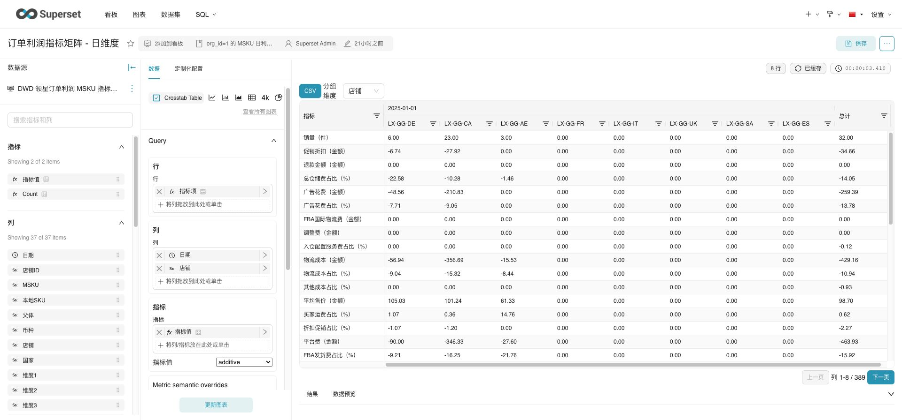

# Crosstab V4 Production Closeout

## Verdict

Status: complete

Crosstab V4 has been pushed, built, deployed to production, and validated on the live Explore page for slice 10. Production Superset is running the rebuilt image, Docker health is healthy, public and server-local health endpoints return OK, and browser validation shows the Crosstab table rendered without V4 control errors.

## Release Provenance

- Local branch: `noway-release`
- Release commit: `138f07d7b5beca30e133e1e9cac9128381e5dfbb`
- Commit subject: `fix(crosstab): guard calculated fields and reset pagination`
- Push result: `fork/noway-release` updated from `2fe61e370b` to `138f07d7b5`
- Post-push divergence: `git rev-list --left-right --count HEAD...fork/noway-release` returned `0 0`
- Pre-release image ID: `83fc8748223d`
- Post-release image ID: `148aa69b3a8c`
- New image digest: `sha256:148aa69b3a8c363b682e1a84350cf4732cbcbfde36002f877ef2420e542533d9`

## Local Validation

Commands run before production publish:

- `git diff --check`: passed
- Focused crosstab Jest command: passed, `21` suites and `260` tests
- `npm run type -- --pretty false`: passed
- `BABEL_ENV=testableProduction npm run build`: webpack compiled successfully with warnings only for asset and entrypoint size
- V4 source/assets diff check after build: no tracked source or asset diff

Existing untracked historical reports/screenshots were left out of the release payload.

## Production Deployment

- Asset backup: `/home/ubuntu/superset-docker/backups/assets-20260522091154`
- Sync scope: local `superset/static/assets/` to remote `/home/ubuntu/superset-docker/superset-source/superset/static/assets/`
- Sync mode: `rsync -az --delete`
- Rebuild command: `docker build -f Dockerfile.doris-zh -t apache-superset-doris:6.0.0-zh-column-scheme-matrix .`
- Restart command: `docker compose up -d superset`
- Docker health wait result: `healthy`

Current production container evidence:

```text
apache-superset         apache-superset-doris:6.0.0-zh-column-scheme-matrix   Up 6 minutes (healthy)   0.0.0.0:8088->8088/tcp, [::]:8088->8088/tcp
apache-superset-redis   redis:7-alpine                                        Up 7 days (healthy)      6379/tcp
apache-superset-doris:6.0.0-zh-column-scheme-matrix 148aa69b3a8c 1.46GB
sha256:148aa69b3a8c363b682e1a84350cf4732cbcbfde36002f877ef2420e542533d9 running healthy
```

## HTTP Validation

- Server-local health: `ssh agentops 'curl -fsS http://127.0.0.1:8088/health'` returned `OK`
- Public health: `curl -fsS --connect-timeout 10 http://111.230.91.24:8088/health` returned `OK`
- Public root: `HTTP/1.1 302 FOUND`, `Location: /superset/welcome/`
- Recent production log scan for `error|exception|traceback|critical`: no output

## Browser Validation

Validated URL:

`http://111.230.91.24:8088/explore/?dashboard_page_id=46-PPo9Im44OCNY7jp1J9&slice_id=10`

Browser evidence:

- Final URL stayed under `/explore/`; it did not redirect to `/login/`
- Explore title: `订单利润指标矩阵 - 日维度`
- Chart type visible: `Crosstab Table`
- V4 field config visible: `data-test="crosstab-field-config-control"`
- Crosstab chart visible: `data-test="crosstab-table"`
- Column pagination visible: `列 1-8 / 389`
- Query result summary visible: `8 行`, cached, `00:00:03.410`
- No visible alerts or V4 control errors for calculated fields, numeric parameter, or dynamic metric controls

Production access log confirmed chart data API success:

```text
POST /api/v1/chart/data?form_data=%7B%22slice_id%22%3A10%7D HTTP/1.1" 200
POST /api/v1/chart/data?form_data=%7B%22slice_id%22%3A10%7D HTTP/1.1" 200
POST /api/v1/chart/data?form_data=%7B%22slice_id%22%3A10%7D HTTP/1.1" 200
POST /api/v1/chart/data?form_data=%7B%22slice_id%22%3A10%7D HTTP/1.1" 200
```

Screenshot:



## Notes

- This release intentionally synced frontend static assets only.
- No production slice metadata was modified during validation.
- Validation timestamp: `2026-05-22T09:19:40+0800`.
