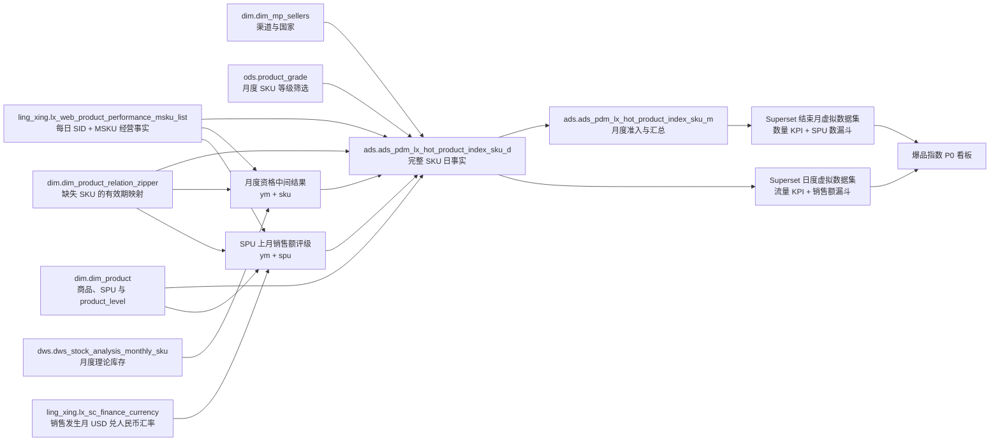

# Hot Product Index Overview Dashboard Design

## Summary

本规格定义 Superset 看板「爆品指数」的 P0 顶部总览，以及支撑该范围的 Doris 日表、月表数据契约。

P0 严格限定为已确认截图中的标题、说明文档入口、13 个全局筛选器、重置按钮、9 个 KPI、`SPU销售额漏斗`和`SPU数漏斗`。先由另一名 Agent 按本规格实现 Doris DDL、历史回填和 Airflow 加工；数据验收通过后，再创建 Superset 数据集、图表和生产看板。

FineBI 页面只作为布局和旧口径的参考，不作为权威数据定义。新看板采用本规格中已确认的可复算口径。

## Goals

- 保留 FineBI 顶部总览的主要视觉结构和操作顺序。
- 用一套可复算的数据契约统一 9 个 KPI、2 个漏斗和 13 个筛选器。
- 以 SKU 每日销售速度定义爆品指数，避免仅统计有销量日期造成高估。
- 使用月度销量与理论库存的统一准入规则，不额外判断产品在售状态。
- 对 SKU 拉链多重/重叠映射、已解析身份缺失维度、缺失库存、汇率、重复行和汇总差异快速失败；零命中只审计。
- 回填主源可用的全部历史，并支持按月重算。
- 分离数据加工、Superset 构建、生产发布和浏览器验收四个阶段。

## Non-Goals

以下内容不进入 P0，也不得提前向两张目标表加入仅服务这些组件的字段：

- SPU/SKU/国家/开发经理/型号经营明细表。
- 天、周、月经营趋势。
- SPU 排行榜和上月、环比、评级达标进度。
- SPU、SKU、颜色销量占比及颜色趋势。
- 近 7/30/90 天指标。
- 评分、订单量、实际库存和 FBA 库存展示。
- FineBI 的备份 Tab、渠道未启用 Tab、空白文本组件及编辑能力。
- 本阶段不实现 Airflow DAG；本规格是交给 Airflow 开发 Agent 的完整需求契约。

后续组件必须分别进入新的规格与实施计划，不在 P0 中预留未使用字段。

## Confirmed Business Decisions

- 默认时间为北京时间本自然月首日至昨日。
- 所有图表统一响应全部全局筛选器。
- 月度有效 SKU 的唯一判断为：

```text
sku_month_sales_qty + theoretical_stock_qty > 10
```

- 不判断 `dim.dim_product.status`，但页面文案仍保留“在售 SPU 数 / 在售 SKU 数”。
- 理论库存使用 `dws.dws_stock_analysis_monthly_sku.total_stock_qty` 的月度值。
- 销售额与毛利润直接使用领星产品表现源中的美元口径数值。
- 退货使用 `return_goods_count`，不得改用退款量 `return_count`。
- `product_level` 是 SKU 行级“SPU最终评级”筛选属性，只能来自 `dim.dim_product.product_level`；空或空字符串显示为“未评级”。同一 SPU 下不同 SKU 的 `product_level` 可以不同，不做 `MAX/MIN`、优先级或任取一行裁决，也不再作为发布阻塞。
- 两个漏斗按 `spu_previous_month_sales_level` 分组。该字段按 `ym + spu` 固定计算：使用目标月前一个完整自然月的全渠道 SPU 销售额，逐行换算为人民币后汇总，再按本规格阈值评级；不受看板渠道、国家、SKU 等筛选器反向重算。
- 人民币换算使用销售发生月的 USD 兑人民币月汇率：`ling_xing.lx_sc_finance_currency.code = 'USD'` 的正数 `my_rate`，金额基数为源美元字段。源行 `currency_code` 不参与评级换算；禁止连接本币汇率、缺失汇率默认 1、使用 `rate_org` 回退，或根据国家、站点、卖家币种推断汇率。
- `spu_previous_month_sales_level` 分档为 `C=[0,50000)`、`B=[50000,100000)`、`A=[100000,300000)`、`S=[300000,1000000)`、`Ps=[1000000,+∞)`；前月完整但 SPU 无销售行、销售额为负数或未落入区间时为 `-`。
- 源 SKU 为空时使用 `dim.dim_product_relation_zipper`，有效区间为左闭右闭 `[start_date, end_date]`；相邻关系必须满足 `next_start = end_date + 1 day`，该口径获得用户明确批准。
- 精确拉链命中 0 条是允许的正常数据：保留源经营指标和 `org_id=1` 店铺维度，下游 `sku`、`spu`、商品维度、资格及 SPU 评级字段统一写 `NULL`。命中多于 1 条仍阻断，禁止任取一行。
- `8010A-BL28-FBM` 在旧关系结束日 2026-05-29 映射到 `ZX-8010S-BL28`，从新关系开始日 2026-05-30 起映射到 `8010S-BL28`。
- 时间字段命名规则：真实日期使用有业务含义的 `DATE` 字段；非日期字符串时间键只使用 `ymd`、`yw`、`ym`。同一日期不重复保存 `DATE` 与 `ymd`。

## Architecture



Superset 不直接查询领星宽源表，也不在各图表中重复解析 JSON、连接拉链表或计算准入资格。所有复杂连接和数据质量检查都在目标表发布前完成。

## Source Contracts

| Source                                           | Grain / Key                     | Fields Used                                                                                                                     | Contract                                                    |
| ------------------------------------------------ | ------------------------------- | ------------------------------------------------------------------------------------------------------------------------------- | ----------------------------------------------------------- |
| `ling_xing.lx_web_product_performance_msku_list` | `ymd_id + sid + msku`           | `ymd_id`, `sid`, `msku`, `sku`, `volume`, `amount`, `gross_profit`, `return_goods_count`, `create_time`                         | P0 唯一经营事实源；仅处理 `org_id=1` 店铺；`amount` 为评级使用的美元金额 |
| `dim.dim_product_relation_zipper`                | `msku + sid + sku + start_date` | `msku`, `sid`, `sku`, `start_date`, `end_date`                                                                                  | 只在源 SKU 为空时使用；按 `[start_date, end_date]` 唯一命中 |
| `dim.dim_product`                                | `sku`                           | `spu`, `product_sku`, `level1`, `single_box_size`, `color`, `product_developer`, `model`, `product_level`, `category`, `org_id` | 组织限定 `org_id = 1`，品类限定 `category = '拉杆箱'`       |
| `dim.dim_mp_sellers`                             | 业务上要求 `org_id + sid` 唯一  | `sid`, `sale_channel`, `country`, `org_id`                                                                                      | `channel = sale_channel`；`country = country`               |
| `ods.product_grade`                              | `ym + SKU`                      | `ym`, `SKU`, `global_label`                                                                                                     | 原值作为“SKU等级”筛选，不做等级归并                         |
| `dws.dws_stock_analysis_monthly_sku`             | `ym + sku`                      | `ym`, `sku`, `total_stock_qty`                                                                                                  | `theoretical_stock_qty = total_stock_qty`                   |
| `ling_xing.lx_sc_finance_currency`                | `date + code`                   | `date`, `code`, `my_rate`                                                                                                       | `date=YYYY-MM`；评级只使用 `code='USD'` 的正数 `my_rate`，所需月份必须唯一 |

已排除 `ling_xing.lx_bp_product_performance_msku`：生产核验显示其结构不能稳定提供 `ymd + sid + msku + sku` 唯一事实，不能支撑 P0 的 SKU 日口径。

`ods.product_grade.ym` 的源类型为 `INT`、格式为 `YYYYMM`。加工时必须显式解析年月，再写为目标字符串 `ym = YYYY-MM`；不得依赖数据库隐式类型转换。

原 FineBI 已现场核验：`SPU销售额漏斗` 与 `SPU数漏斗` 都使用“上月销售额评级”，前者的颜色、标签和纵轴均绑定该字段。“汇率换算为人民币”步骤把原始 USD“上月销售额” `69.99` 与 USD 月汇率 `7.2` 计算为人民币“销售额” `503.93`，即逐行执行 `ROUND(69.99 * 7.2, 4)` 后再按 SPU 月汇总。另一个 EUR 行同时显示本币汇率 `7.9`、美元汇率 `7.2`、USD 上月销售额 `47.24` 和人民币销售额 `340.09`；考虑显示精度后，只有 USD 汇率能近似复算，使用 EUR 汇率会得到约 `373.20`。因此评级固定选 USD 月汇率，不按源行本币选择汇率。P0 的销售额 KPI 和毛利润仍保留既定美元字段，不因评级计算改口径。

### Verified Production Preconditions

2026-08-03 的只读生产核验得到以下边界：

- 主源已有数据区间为 2023-02-01 至 2023-05-31，以及 2024-07-01 至 2026-08-03；已核验年份内源 `sku` 均为空。
- 月度库存覆盖 2022-07 至 2026-08。
- `ods.product_grade` 覆盖 2023-01 至 2026-08。
- SKU 关系拉链最早 `start_date` 为 2024-01-01，因此 2023 年源事实会形成未配对审计行。

“回填主源全部历史”不得静默从 2024 年开始，也不得用当前 SKU 反填 2023 年。2023-02-01 至 2023-05-31 的完整源事实必须保留，无法精确命中关系拉链的行按未配对合同写入，商品身份、资格和 SPU 评级字段统一为 `NULL`；该缺口只审计，不阻断。

2023-06 至 2024-06 位于主源两个已知数据区间之间，不能因库存存在就解释为全量零销量。没有“该月经营源已完整同步”的可信完成信号时，只在 Airflow 运行审计中记录缺失月份，不向两张业务目标表发布库存驱动的零销量事实。

截至 2026-08-06，`dws_stock_analysis_monthly_sku` 的真实 owner DAG 已存在并有生产成功记录，但尚未发布独立 `ready_yms/completed_at` Metadata；普通表 Asset 不能替代 readiness。ODS 产品表现 Asset 尚未发布版本化 coverage Metadata。2025-03/04/05 与 2026-06 的月度回填失败，2026-07 尚无已提交完整性证据，因此这些月份均不得标记为 complete，也不得通过源表有行或 `MAX(date)` 推断完成。

实现采用版本化历史 coverage 基线加成功事件增量：历史 complete 必须绑定成功 run ID，audited gap 必须绑定明确审计证据；日常同步和月度回填仅在四个产品表现 DSP 任务全部成功后发布带 source run ID 的不可变事件。目标运行从事件流确定性重建 manifest。库存 owner 仅在全量写入提交且重复键/空库存检查通过后发布独立 Ready Asset。以上代码合同不代表生产已部署或月份已解除门禁。

### Filter Field Mapping

除时间列外，两张目标表使用相同筛选字段名，使一个 Superset 原生筛选器可以同时作用于日、月两个数据集。年月使用 `filter_month_range`：日数据集目标列为 `sales_date`，结束月数据集目标列为 `month_start_date`，控件统一显示 `YYYY-MM`。该筛选组件及其左闭右开整月语义是生产构建前置条件，必须先在生产分支安装并通过独立验收；本规格不把本地未发布代码视为已具备能力。

| UI Filter   | Target Field                                | Authoritative Source                                           |
| ----------- | ------------------------------------------- | -------------------------------------------------------------- |
| 渠道        | `channel`                                   | `dim.dim_mp_sellers.sale_channel`                              |
| 品线        | `product_line`                              | `dim.dim_product.level1`                                       |
| SPU         | `spu`                                       | `dim.dim_product.spu`                                          |
| 国家        | `country`                                   | `dim.dim_mp_sellers.country`                                   |
| 公司SKU     | `company_sku`                               | `dim.dim_product.product_sku`                                  |
| SKU         | `sku`                                       | 源 SKU；为空时尝试关系拉链；0 命中保留为 `NULL`                |
| 尺寸        | `size`                                      | `dim.dim_product.single_box_size`                              |
| 颜色        | `color`                                     | `dim.dim_product.color`                                        |
| 年月        | 日表 `sales_date` / 月表 `month_start_date` | `filter_month_range` 生成整月时间范围；两表同时保留字符串 `ym` |
| 开发经理    | `developer`                                 | `dim.dim_product.product_developer`                            |
| 型号        | `model`                                     | `dim.dim_product.model`                                        |
| SKU等级     | `sku_level`                                 | `ods.product_grade.global_label`                               |
| 产品等级    | `product_level`                             | `dim.dim_product.product_level`                                |

`company_sku`、`developer`、`sku_level` 等业务本身允许未维护的维度保留 `NULL`；不得从名称、MSKU 或其他字段猜测填充。已匹配商品的空 `product_level` 按已确认展示规则写为“未评级”；未配对源行的 `product_level` 保持 `NULL`。筛选器中的 `product_level` 与漏斗分组字段 `spu_previous_month_sales_level` 是两个独立概念，不得互相覆盖。

## Daily Table Contract

Table: `ads.ads_pdm_lx_hot_product_index_sku_d`

### Grain and Storage

- 业务粒度：`sales_date + sid + msku`。
- 唯一键：`sales_date, sid, msku`。
- `sku` 是按日期解析后的属性，不加入日表唯一键；同一源键只能解析出一个 SKU。
- DDL 按 `sales_date, sid, msku` 顺序把唯一键列置于全部非键列之前。
- 按 `sales_date` 的自然月做 RANGE 分区。
- 按 `sid, msku` HASH 分 16 buckets。
- 每次发布按分区原子替换；质量检查失败时不得覆盖上一批正确分区。

### Fields

| Field                   | Type            | Nullable | Definition                                               |
| ----------------------- | --------------- | -------: | -------------------------------------------------------- |
| `sales_date`            | `DATE`          |       No | 源 `ymd_id`；目标表不再保存同义 `ymd`                    |
| `sid`                   | `VARCHAR(255)`  |       No | 店铺 SID，与主源类型一致                                 |
| `msku`                  | `VARCHAR(255)`  |       No | 店铺 MSKU                                                |
| `ym`                    | `VARCHAR(7)`    |       No | `YYYY-MM`                                                |
| `sku`                   | `VARCHAR(255)`  |      Yes | 唯一解析的本地 SKU；拉链 0 命中时为 `NULL`               |
| `spu`                   | `VARCHAR(255)`  |      Yes | `dim_product.spu`；未配对时为 `NULL`                     |
| `company_sku`           | `VARCHAR(255)`  |      Yes | `dim_product.product_sku`                                |
| `channel`               | `VARCHAR(64)`   |       No | `dim_mp_sellers.sale_channel`                            |
| `product_line`          | `VARCHAR(100)`  |      Yes | `dim_product.level1`                                     |
| `country`               | `VARCHAR(64)`   |       No | `dim_mp_sellers.country`                                 |
| `size`                  | `VARCHAR(100)`  |      Yes | `dim_product.single_box_size`                            |
| `color`                 | `VARCHAR(100)`  |      Yes | `dim_product.color`                                      |
| `developer`             | `VARCHAR(255)`  |      Yes | `dim_product.product_developer`                          |
| `model`                 | `VARCHAR(255)`  |      Yes | `dim_product.model`                                      |
| `sku_level`             | `VARCHAR(255)`  |      Yes | 当月 `product_grade.global_label` 原值                   |
| `product_level`         | `VARCHAR(255)`  |      Yes | 已匹配商品空值写“未评级”；未配对时为 `NULL`             |
| `spu_previous_month_sales_amount_cny` | `DECIMAL(20,4)` | Yes | 同一 `ym + spu` 的前月全渠道销售额人民币汇总；无前月 SPU 行或前月源不完整时为空 |
| `spu_previous_month_sales_level` | `VARCHAR(16)` | Yes | 按前月人民币销售额分档；前月源不完整时为空，前月完整但无 SPU 行时为 `-` |
| `sales_qty`             | `BIGINT`        |       No | 源 `volume`；补零行写 0                                  |
| `sales_amount_usd`      | `DECIMAL(20,4)` |       No | 源 `amount`；补零行写 0                                  |
| `gross_profit_usd`      | `DECIMAL(20,4)` |       No | 源 `gross_profit`；补零行写 0                            |
| `return_goods_qty`      | `BIGINT`        |       No | 源 `return_goods_count`；补零行写 0                      |
| `sku_month_sales_qty`   | `BIGINT`        |      Yes | `ym + sku` 全渠道月销量；未配对时为 `NULL`               |
| `theoretical_stock_qty` | `DECIMAL(18,2)` |      Yes | `ym + sku` 月度 `total_stock_qty`；未配对时为 `NULL`     |
| `eligibility_value`     | `DECIMAL(20,2)` |      Yes | 已匹配时为销量加库存；未配对时为 `NULL`                  |
| `is_eligible`           | `TINYINT`       |      Yes | 已匹配时按阈值计算；未配对时为 `NULL`                    |
| `is_generated_zero`     | `TINYINT`       |       No | 日期补齐行标记为 1，源事实行标记为 0                     |
| `data_through_date`     | `DATE`          |       No | 最近一次成功日常发布确认的全局业务水位；历史回填不得推进 |
| `source_updated_at`     | `DATETIME`      |       No | 源事实行取其 `create_time`；补零行取可信上游完成信号时间 |
| `etl_batch_id`          | `VARCHAR(64)`   |       No | 加工批次标识                                             |
| `etl_loaded_at`         | `DATETIME`      |       No | 目标分区发布时间                                         |

## Monthly Table Contract

Table: `ads.ads_pdm_lx_hot_product_index_sku_m`

### Grain and Storage

- 业务粒度与唯一键：`ym + sid + msku + sku`。
- 月表必须包含 `sku` 键。MSKU 在月中可能因拉链切换映射到不同 SKU，仅使用 `ym + sid + msku` 会错误合并切换前后的产品。
- DDL 按 `ym, sid, msku, sku` 顺序把唯一键列置于全部非键列之前。
- `ym` 保持 `YYYY-MM` 字符串，按 `ym` 单值做 LIST 分区；不得对 `VARCHAR(7)` 使用 RANGE 分区。
- 按 `sid, msku` HASH 分 16 buckets。
- 月表由已补齐并已解析 SKU 的日表汇总，不直接重复实现一套源连接逻辑。

### Fields

月表不保存 `sales_date`、`is_generated_zero`，完整字段如下：

| Field                   | Type            | Nullable | Definition                                       |
| ----------------------- | --------------- | -------: | ------------------------------------------------ |
| `ym`                    | `VARCHAR(7)`    |       No | `YYYY-MM`                                        |
| `sid`                   | `VARCHAR(255)`  |       No | 店铺 SID                                         |
| `msku`                  | `VARCHAR(255)`  |       No | 店铺 MSKU                                        |
| `sku`                   | `VARCHAR(255)`  |      Yes | 唯一解析的本地 SKU；未配对时为 `NULL`            |
| `month_start_date`      | `DATE`          |       No | `ym` 对应自然月第一日，只用于 Superset 时间过滤  |
| `spu`                   | `VARCHAR(255)`  |      Yes | `dim_product.spu`；未配对时为 `NULL`             |
| `company_sku`           | `VARCHAR(255)`  |      Yes | `dim_product.product_sku`                        |
| `channel`               | `VARCHAR(64)`   |       No | `dim_mp_sellers.sale_channel`                    |
| `product_line`          | `VARCHAR(100)`  |      Yes | `dim_product.level1`                             |
| `country`               | `VARCHAR(64)`   |       No | `dim_mp_sellers.country`                         |
| `size`                  | `VARCHAR(100)`  |      Yes | `dim_product.single_box_size`                    |
| `color`                 | `VARCHAR(100)`  |      Yes | `dim_product.color`                              |
| `developer`             | `VARCHAR(255)`  |      Yes | `dim_product.product_developer`                  |
| `model`                 | `VARCHAR(255)`  |      Yes | `dim_product.model`                              |
| `sku_level`             | `VARCHAR(255)`  |      Yes | 当月 `product_grade.global_label` 原值           |
| `product_level`         | `VARCHAR(255)`  |      Yes | 已匹配商品空值写“未评级”；未配对时为 `NULL`     |
| `spu_previous_month_sales_amount_cny` | `DECIMAL(20,4)` | Yes | 同一 `ym + spu` 的前月全渠道销售额人民币汇总；无前月 SPU 行或前月源不完整时为空 |
| `spu_previous_month_sales_level` | `VARCHAR(16)` | Yes | 按前月人民币销售额分档；前月源不完整时为空，前月完整但无 SPU 行时为 `-` |
| `sales_qty`             | `BIGINT`        |       No | `ym + sid + msku + sku` 月销量汇总               |
| `sales_amount_usd`      | `DECIMAL(20,4)` |       No | 月销售额汇总                                     |
| `gross_profit_usd`      | `DECIMAL(20,4)` |       No | 月毛利润汇总                                     |
| `return_goods_qty`      | `BIGINT`        |       No | 月退货量汇总                                     |
| `sku_month_sales_qty`   | `BIGINT`        |      Yes | `ym + sku` 全渠道月销量；未配对时为 `NULL`       |
| `theoretical_stock_qty` | `DECIMAL(18,2)` |      Yes | `ym + sku` 月度理论库存；未配对时为 `NULL`       |
| `eligibility_value`     | `DECIMAL(20,2)` |      Yes | 已匹配时为销量加库存；未配对时为 `NULL`          |
| `is_eligible`           | `TINYINT`       |      Yes | 已匹配时按阈值计算；未配对时为 `NULL`            |
| `data_through_date`     | `DATE`          |       No | 与日表一致的全局已批准业务水位；历史回填不得推进 |
| `source_updated_at`     | `DATETIME`      |       No | 该月日表行的最大 `source_updated_at`             |
| `etl_batch_id`          | `VARCHAR(64)`   |       No | 加工批次标识                                     |
| `etl_loaded_at`         | `DATETIME`      |       No | 分区发布时间                                     |

`month_start_date` 是真实 `DATE` 语义，`ym` 是月键与 LIST 分区值；两者用途不同。禁止再增加同义的字符串 `ymd` 或其他月份编码。

理论库存会重复下发到同一 SKU 的多个 SID/MSKU 行，只能用于准入判断，禁止从目标表直接 `SUM(theoretical_stock_qty)`。P0 不展示库存指标。

## Processing Rules

### 1. Resolve SKU

1. 读取主源唯一键 `ymd_id + sid + msku`。
2. 源 `sku` 非空时直接使用，不查询关系拉链。
3. 源 `sku` 为空时，以 `msku + sid` 连接 `dim_product_relation_zipper`：

```sql
sales_date >= start_date
AND sales_date <= end_date
```

4. 命中 0 条时保留源行并将下游商品身份、资格和评级字段写 `NULL`；命中多于 1 条时本批次失败并输出 `sales_date, sid, msku` 冲突清单。
5. 不允许按 `is_current`、SKU 前缀、字典序或最新创建时间猜测映射。

源 SKU 非空时，它只对该源事实日期的 SKU 身份具有权威性。若该身份 `is_eligible = 1` 且需要补齐其他日期，关系拉链必须存在与源 SKU 一致的有效区间；不一致或缺失时分区失败。关系拉链可以证明身份区间，但不得覆盖源记录当天的非空 SKU。

边界验收样例：

| sales_date |  sid | msku             | Expected SKU    |
| ---------- | ---: | ---------------- | --------------- |
| 2026-05-29 | 2613 | `8010A-BL28-FBM` | `ZX-8010S-BL28` |
| 2026-05-30 | 2613 | `8010A-BL28-FBM` | `8010S-BL28`    |

已核验的主源样例必须在目标日表中保持原指标且只出现一次：

| sales_date |  sid | msku             | Expected SKU    | sales_qty | sales_amount_usd |
| ---------- | ---: | ---------------- | --------------- | --------: | ---------------: |
| 2026-06-01 | 2613 | `8010A-BL28-FBM` | `8010S-BL28`    |        11 |          2276.89 |
| 2026-06-02 | 2613 | `8010A-BL28-FBM` | `8010S-BL28`    |         3 |           749.97 |
| 2026-06-03 | 2613 | `8010A-BL28-FBM` | `8010S-BL28`    |         5 |          1249.95 |

### 2. Enrich Dimensions

- 使用解析后的 `sku` 唯一连接 `dim.dim_product`，先校验 SKU 维度唯一性和组织归属，再只保留 `org_id = 1 AND category = '拉杆箱'` 的合法事实与拉链身份。
- 合法非拉杆箱商品被明确排除，不视为错误；缺少产品行、重复产品行、SPU 为空或组织归属不明确时，本批次失败。
- 使用 `sid` 唯一连接 `dim.dim_mp_sellers` 的 `org_id = 1` 行。缺少 SID、同一 SID 多行、渠道或国家为空时，本批次失败。
- `sku_level` 按目标 `ym + sku` 连接 `ods.product_grade`；没有记录时保留 `NULL`，不影响资格与指标。
- `product_level` 直接取 `dim_product.product_level`；只有数据库空值和空字符串转成“未评级”，其他值原样保留。
- 同一 SPU 下多个 SKU 的 `product_level` 可以不同。任务应输出 `ym + spu + sku + product_level` 审计清单，但该现象不阻塞发布；月表只要求同一 `ym + sid + msku + sku` 内该 SKU 行级属性一致。

`dim.dim_product` 与 `dim.dim_mp_sellers` 都不是历史拉链维度，因此商品属性、渠道和国家表达“加工时可见的当前维度”，不伪装为历史时点值。任一维度发生变化时，任务必须重算所有包含受影响 SKU 或 SID 的历史分区；无法定位受影响月份时执行全历史重算，避免不同月份保留不同版本的当前维度。

### 3. Compute SPU Previous-Month Sales Level

该评级独立于 SKU 月资格和看板筛选器，固定在 `target_ym + spu` 粒度计算：

1. 每个目标 `target_ym` 声明其前一个自然月作为 lookback。只有该前月在版本化 manifest 中为 `complete` 时才读取、解析并参与评级；`audited_gap` 或 `untrusted` 前月的任何原始行都不进入 source resolution，评级直接为 NULL。lookback 永不作为目标分区发布。
2. 使用与主事实相同的 `sid + msku + [start_date,end_date]` SKU 解析、`org_id = 1 AND category = '拉杆箱'` 商品域过滤。评级汇总包含该 SPU 前月全部渠道和全部 SKU 源事实，不使用 `is_eligible` 过滤。
3. 按销售发生月连接唯一的 USD 兑人民币汇率：

```sql
DATE_FORMAT(source.sales_date, '%Y-%m') = fx.date
AND fx.code = 'USD'
```

4. 先逐行计算 `ROUND(source.sales_amount_usd * CAST(fx.my_rate AS DECIMAL(20,10)), 4)`，再按 `source_ym + spu` 求和。把 `source_ym` 右移一个自然月得到目标 `ym`，禁止用日期天数近似月份偏移。
5. 依据下列半开区间生成 `spu_previous_month_sales_level`：

```sql
CASE
  WHEN previous_month_sales_amount_cny >=       0 AND previous_month_sales_amount_cny <   50000 THEN 'C'
  WHEN previous_month_sales_amount_cny >=   50000 AND previous_month_sales_amount_cny <  100000 THEN 'B'
  WHEN previous_month_sales_amount_cny >=  100000 AND previous_month_sales_amount_cny <  300000 THEN 'A'
  WHEN previous_month_sales_amount_cny >=  300000 AND previous_month_sales_amount_cny < 1000000 THEN 'S'
  WHEN previous_month_sales_amount_cny >= 1000000 THEN 'Ps'
  ELSE '-'
END
```

前月源已确认完整但某个当前 SPU 没有前月源行时，`spu_previous_month_sales_amount_cny=NULL`、`spu_previous_month_sales_level='-'`。前月源缺少可信完成信号或属于审计断档时，两字段都写 `NULL`，对应目标月的两个漏斗不计算并显示评级源不完整；不得把上游缺口伪装成 `-`。同一目标 `ym + spu` 的金额和评级必须完全一致地写到该 SPU 的全部日/月目标行。

独立的汇率输入门禁必须先于任何评级汇总执行，并在发布前复验：对 `previous_month_source_complete_flag = 1` 的每个所需 lookback 源月，恰好存在一条 `code = 'USD'` 的汇率记录，且 `my_rate` 可转为正数。前月不完整时不要求汇率，直接保留 NULL 评级。源行 `currency_code`、`dim_mp_sellers.currency`、国家和站点均不得参与评级汇率选择；任何必需汇率缺失、重复或非法值都失败，禁止默认汇率或 `rate_org` 回退。

### 4. Compute Monthly Eligibility

资格必须在看板筛选之前、按全渠道 `ym + sku` 固定计算：

在已证明本月应覆盖窗口完整的月份内，SKU 月候选集合为“当月已映射主源 SKU”与“当月库存表中属于 `org_id = 1 AND category = '拉杆箱'` 的 SKU”的并集。已结束月份的窗口是整月；北京时间当前月的窗口是月初至本批候选 `coverage_end_date`。没有单品源事实的库存 SKU，其 `sku_month_sales_qty = 0`；这是基于完整应覆盖窗口的确定性零值，不是对缺失源月份的补数。

```text
sku_month_sales_qty = SUM(source.volume) BY ym, resolved_sku
eligibility_value = sku_month_sales_qty + total_stock_qty
is_eligible = eligibility_value > 10
```

规则：

- 只判断上述公式，不增加产品状态条件。
- 页面渠道、国家、开发经理等筛选器只缩小展示事实，不重新改变 SKU 的月度资格。
- `total_stock_qty` 缺失不是 0；任何候选 SKU 缺少对应 `ym + sku` 库存时，本月分区失败并输出清单。
- 同一 SKU 的库存只参与一次资格计算，再把结果下发至其 SID/MSKU 行。
- 销售存在但库存为 0 时可以正常计算；销量与库存合计不大于 10 时不进入有效范围。

先在 `ym + sku` 粒度计算资格，再构造候选身份集合：

1. 当月主源中出现、已唯一解析 SKU 且通过 `org_id = 1 AND category = '拉杆箱'` 过滤的 `sid + msku + sku`。
2. 对每个 `is_eligible = 1` 的 SKU，纳入当月与 `[start_date, end_date]` 有交集、并通过相同拉杆箱维度过滤的全部关系拉链 `sid + msku + sku` 身份。

第二部分既保证“当月无销量但理论库存大于 10”的 SKU 进入看板，也保证由销量驱动达标的 SKU 在其他有效渠道/MSKU 下拥有完整 SKU 日。若有效 SKU 没有任何有效 `sid + msku` 关系，就无法赋予渠道和国家，分区必须失败并输出清单，不能把它挂到虚构店铺。

DAG 必须保留以下相互独立的发布前结果，作为后续集合验收的基准，不得从日表或月表反推：

- `candidate_sku_staging(ym, sku)`：由域内已解析主源 SKU 与域内库存 SKU 的并集生成。
- `eligibility_staging(ym, sku, sku_month_sales_qty, theoretical_stock_qty, eligibility_value, is_eligible)`：由候选集合、域内源销量和库存直接生成，每个候选 SKU 恰好一行。
- `eligible_identity_staging(ym, sid, msku, sku, identity_start_date, identity_end_date)`：由 `is_eligible = 1` 的 SKU 与原始左闭右闭拉链生成；裁剪后的 `identity_end_date` 仍为包含的右边界，不得额外加一天。

这三份 staging 是独立预期集合。若日表和月表同时漏掉一个库存驱动的有效 SKU，验收仍必须通过它们发现缺失，不能形成“目标表验证目标表”的循环证明。

目标表保留主源中资格为 0 和 1 的已映射事实，便于完整对账；Superset 数据集固定过滤 `is_eligible = 1`。只有资格为 1 的身份需要生成缺失日期补零行，资格为 0 的身份不扩展无业务事实的日期。

### 5. Build the Complete SKU-Day Spine

- 日常运行把 Airflow 逻辑日期对应的北京时间前一自然日作为候选水位。只有上游完成、两张表同批校验与发布均成功后，候选值才成为新的全局已批准 `data_through_date`。
- 手工历史回填和历史分区重算必须读取并沿用运行开始前的已批准水位，不能用自身逻辑日期推进水位。发布失败或补偿回滚时水位保持不变。
- 主源查询必须满足 `sales_date <=` 本批候选或已批准水位，不得纳入当日未完整数据。
- SKU 日范围是月范围、可证明的身份有效范围和 `data_through_date` 的交集。
- 对当月有效 SKU 的每个 `sid + msku + sku` 身份生成完整日期行。
- 源事实缺少该日记录时生成指标全 0、`is_generated_zero = 1` 的行。
- 不能仅保留销量大于 0 的日期，也不能用源行数直接作为爆品指数分母。
- 以 `ym + spu` 连接已计算的 `spu_previous_month_sales_amount_cny` 与 `spu_previous_month_sales_level`；同一 SPU 的所有 SKU、SID、MSKU 和补零日必须取得相同值。
- 同一 SKU 即使属于多个 SID/MSKU，在爆品指数分母中同一天仍只计一次。
- 任务必须依赖主源“昨日分区已完成”的上游完成信号；仅检查 `MAX(ymd_id)` 不足以证明昨日数据完整。
- 上游未完成或源数据未覆盖候选水位时不发布新分区，保留上一批正确分区并让页面展示旧的已批准 `data_through_date`。

### 6. Aggregate the Monthly Table

- 仅从日表按 `ym + sid + msku + sku` 聚合可加指标。
- SKU 行级维度、资格、SPU 上月销售额及评级在该粒度必须唯一；不唯一时失败。不同 SKU 的 `product_level` 不要求在 SPU 粒度唯一。
- 日表月汇总与月表指标必须完全一致，不允许独立读取另一事实源补数。

## Superset Serving Datasets

P0 在两张物理表之上建立两个虚拟数据集。`filter_month_range` 产生左闭右开的整月 `time_range`，虚拟 SQL 使用 `get_time_filter(..., remove_filter=True)` 读取明确的用户选择边界并手动应用，不能从筛选后事实的 `MIN/MAX(ym)` 反推选择范围。

### Daily Serving Dataset

- 时间目标列：`sales_date`。
- 从时间过滤器取得 `filter_start_date` 与排他的 `filter_end_date`。
- 查询日表时使用 `sales_date >= filter_start_date AND sales_date < filter_end_date`。
- 向每行投影相同的 `selected_start_date`、`selected_end_date = DATE_SUB(filter_end_date, INTERVAL 1 DAY)` 与 `effective_end_date = LEAST(selected_end_date, global_data_through_date)`。
- `selected_calendar_days = DATEDIFF(effective_end_date, selected_start_date) + 1`，不依赖筛选后事实是否覆盖首月。
- 若 `effective_end_date < selected_start_date`，例如北京时间每月 1 日选择本月但数据只更新至上月末，则返回空结果且指标为 `NULL`，不得产生 0 或负数分母。
- 用于销量、日均销量、销售额、爆品指数、毛利润、毛利率、退货率和 SPU 销售额漏斗。

### End-Month Serving Dataset

- 时间目标列：`month_start_date`。
- 从同一时间过滤器取得排他的 `filter_end_date`。
- 虚拟 SQL 只返回 `month_start_date = DATE_TRUNC(DATE_SUB(filter_end_date, INTERVAL 1 DAY), 'month')` 的月表行，参数顺序遵循 Doris 语法。
- 用于“在售 SPU 数”“在售 SKU 数”和 SPU 数漏斗，确保跨月范围始终只取用户所选结束月，而不是有事实数据的最大月份。

### Freshness Query

数据新鲜度状态不放入上述两个受业务筛选的数据集。它通过一个不受 13 个原生筛选器作用的查询读取日表全局 `MAX(data_through_date)`。该值可靠的前提是 Airflow 严格执行全局已批准水位协议：日常同批发布成功后才能推进，历史回填只能复制已批准值。

生产 Superset 必须启用并验证 SQL 模板能力及 `filter_month_range`，使上述 `get_time_filter` 合同可执行；不能实现时不得改用事实 `MIN/MAX` 近似。

用户选择范围必须全部落在 Airflow 运行审计确认的连续已发布覆盖区间。若范围包含 zero-source 审计月或未发布月，两个业务数据集都返回不完整覆盖状态，9 个 KPI 与 2 个漏斗不计算；页面明确显示“所选范围存在数据缺口”。不得把缺口月份计入 `selected_calendar_days` 后再当作零销量。

## KPI Definitions

9 张 KPI 均只统计所选范围内 `is_eligible = 1` 的事实。除数量卡外，指标读取日表。

| KPI       | Formula                                                   | Display          |
| --------- | --------------------------------------------------------- | ---------------- |
| 销量      | `SUM(sales_qty)`                                          | 整数、千分位     |
| 日均销量  | `SUM(sales_qty) / NULLIF(MAX(selected_calendar_days), 0)` | 2 位小数         |
| 销售额    | `SUM(sales_amount_usd)`                                   | 美元口径、千分位 |
| 在售spu数 | 筛选结束月份月表 `COUNT(DISTINCT spu)`                    | 整数             |
| 爆品指数  | `SUM(sales_qty) / COUNT(DISTINCT sales_date, sku)`        | 2 位小数         |
| 在售sku数 | 筛选结束月份月表 `COUNT(DISTINCT sku)`                    | 整数             |
| 毛利润    | `SUM(gross_profit_usd)`                                   | 2 位小数、千分位 |
| 毛利率    | `SUM(gross_profit_usd) / SUM(sales_amount_usd)`           | 百分比 2 位      |
| 退货率    | `SUM(return_goods_qty) / SUM(sales_qty)`                  | 百分比 2 位      |

补充规则：

- 月范围跨多月时，销量、日均、销售额、爆品指数、毛利润、毛利率和退货率覆盖全部选中月份；“在售”数量只看筛选结束月份。
- `selected_calendar_days` 是年月范围首月 1 日到末月最后一日的连续自然日数；末月为北京时间当前月时正常截止昨日。若数据延迟，则计算截止日显式取 `MIN(用户选择截止日, data_through_date)`，不把未知日期伪造成零销量。
- Superset 指标使用日度虚拟数据集投影的明确时间过滤边界，不使用 `MIN(ym)`、`MAX(ym)`、事实日期或事实行数替代用户选择范围。
- 爆品指数衡量一个有效 SKU 每日平均销售速度。其分母是唯一 `sales_date + sku` 数，不是源行数，也不是有销量日期数。
- 爆品指数的 SKU 日范围同样只到全局 `data_through_date`；数据延迟必须由页面状态显式说明。
- 毛利率和退货率必须由汇总后的分子、分母重算，不允许平均源比率。
- 任一比率分母为 0 时返回 `NULL`，不得显示无穷值或伪造为 0。

## Funnel Definitions

两个漏斗使用和 KPI 相同的资格范围、全局筛选器和时间语义，但分组评级是加工时固定的 `spu_previous_month_sales_level`；筛选器只缩小展示行，不重算评级。

### SPU销售额漏斗

- 数据源：日表。
- 分组：`spu_previous_month_sales_level`。
- 值：`SUM(sales_amount_usd)`。
- 占比：该等级销售额除以筛选后全部等级销售额。
- 各等级金额合计必须等于“销售额”KPI。
- 标签格式：`$61.5万 | 40.11%`，金额按万美元保留 1 位，占比保留 2 位。

### SPU数漏斗

- 数据源：月表筛选结束月份。
- 分组：`spu_previous_month_sales_level`。
- 值：`COUNT(DISTINCT spu)`。
- 占比：该等级 SPU 数除以筛选后全部有效 SPU 数。
- 各等级数量合计必须等于“在售spu数”KPI。
- 标签格式：`1 | 4.76%`。

漏斗展示全部非零上月销售额等级。固定顺序为：

```text
Ps, S, A, B, C, -
```

`spu_previous_month_sales_level` 只能取 `S/A/B/C/Ps/-` 或表示前月源不完整的 `NULL`；出现其他值时数据验收失败。任一参与范围存在 `NULL` 时两个漏斗均不计算，不把 `NULL` 合并到 `-`。

## Dashboard Experience

### Layout

自上而下保持以下结构：

1. 浅绿色标题栏，标题为“拉杆箱在售产品爆品指数看板”，右侧为“说明文档”入口。
2. 两行全局筛选区，包含 13 个筛选器和蓝色重置按钮。
3. “爆品指数总览”分区标题。
4. 桌面宽屏一行展示 9 张 KPI 卡。
5. 下一行左右各占一半，展示两个完整漏斗。

颜色、间距、字体层级和漏斗形态尽量保持 FineBI 截图效果，但使用 Superset 现有主题与图表能力，不引入仅供本看板使用的前端组件。卡片圆角不超过 8px，任何宽度不得出现文字或组件重叠。

### Filters

- 12 个维度筛选器均为可搜索多选，下拉默认“无限制”。
- 年月为 `ym` 范围筛选，默认北京时间本月到本月；数据实际截止昨日。
- 重置恢复本月和其余“无限制”状态。
- 13 个筛选器同时作用于 9 个 KPI 和 2 个漏斗。
- 页面显示“数据更新至 YYYY-MM-DD”，该状态不受业务筛选器影响，并从日表全局 `MAX(data_through_date)` 读取。
- 数据落后于北京时间昨日时，年月选择仍保持用户选择范围，同时醒目显示实际计算截止日；不得无提示地回退截止日，也不得把缺失源日期补成销量 0。

### Explanation Document

“说明文档”保留为右上角入口并在新标签页打开。原 FineBI 地址
`https://bi.wbkjgr.com/webroot/decision/link/ibDT` 仅作为迁移参考；生产发布前必须配置一个浏览器可正常访问的新文档地址。若地址不可访问，生产发布验收失败，不交付失效链接。

## Airflow Handoff Requirements

另一名 Agent 的 DDL 与 Airflow 实现必须满足以下边界：

- 创建本规格定义的两张 `ads_pdm` 表，不改变表名、粒度和字段语义。
- 首次回填主源可用的全部历史月份。
- 启动全历史回填前，审计拉链覆盖与主源最小业务日期；未覆盖的零命中行按未配对合同保留，多重命中仍直接失败。
- 日常任务在领星日源和月度库存依赖完成后运行。
- 领星源完成事件必须携带版本化的 `complete_source_yms`、`audited_source_gap_yms` 和 `coverage_manifest_id`；目标月没有权威完成记录时失败，前月没有完整记录时评级写 NULL。不得用源表 `MAX(ymd_id)` 猜测完成状态。
- 每日只重算“北京时间逻辑日减一天”所得候选水位所在月份；因此每月 1 日只重算刚结束的上月，不创建尚无候选业务日的新月分区。
- 提供 `start_ym`、`end_ym`（`YYYY-MM` 字符串）参数化回填入口；产品维度、拉链或库存修正后必须重算受影响月份。
- 日表与月表同批 staging 全部通过质量校验后才能开始发布。发布前保留两张表的旧分区；平台不支持跨表事务时仍须串行化写入，任一分区替换失败时补偿回滚已替换分区。业务明确接受逐表替换窗口内一个数据集为新批次、另一个仍为旧批次的短暂读异常，因此不再要求共同批次发布锁或等价读隔离；发布成功后两个数据集必须收敛到同一 `etl_batch_id`。
- 全局业务水位是发布协议的一部分：日常运行只在两表同批发布成功后推进；历史回填读取并复制已批准水位。首次全历史发布必须包含最新可发布月份，并在全部分区成功后一次性建立初始水位。
- 任务输出源最大日期、目标行数、补零行数、允许的未配对审计、重复映射、缺失维度、缺失库存、汇率门禁、SPU 上月销售额评级复算、SKU 行级 `product_level` 多值审计和日月对账结果。
- 不在 DAG 中实现猜测式 fallback，不使用 `ROW_NUMBER() = 1` 隐藏多重映射。
- 本规格不规定通知渠道；任务失败告警沿用 ETL 项目已有运维机制。

## Error Handling and Data Quality Gates

以下任一条件成立时，对应分区不得发布：

1. 主源 `ymd_id + sid + msku` 重复。
2. 源 SKU 为空且拉链命中数多于 1；0 命中不阻断。
3. 拉链声明键重复、同一 `sid + msku` 区间重叠，或相邻关系不满足 `next_start = end_date + 1 day`。
4. 已解析 SKU 缺少或重复 `dim_product`、SPU 为空，或组织归属无法唯一判断；合法的非拉杆箱商品应排除而不是报错。0 命中源行不进入该门禁。
5. SID 缺少唯一渠道或国家，或卖家维度声明键重复。
6. 候选 `ym + sku` 缺少或重复理论库存记录，或 SKU 等级声明键重复。
7. `candidate_sku_staging`、`eligibility_staging` 或 `eligible_identity_staging` 的声明键重复、集合缺失或集合多出。
8. 任一 `previous_month_source_complete_flag = 1` 的所需 lookback 源月缺少 `code = 'USD'` 的汇率、同月 USD 汇率不唯一，或 `my_rate` 非正数、无法解析。
9. 同一 `ym + spu` 的 `spu_previous_month_sales_amount_cny` 或 `spu_previous_month_sales_level` 不唯一，或不能按独立源复算。
10. 需要统计的源指标出现 `NULL`。
11. 完整 SKU 日集合与独立有效身份及日历生成的预期集合不一致。
12. 源事实与日表非补零行的 SKU、指标或派生维度不一致。
13. 日表聚合与月表不一致，或任一目标唯一键重复。
14. `ym`、`month_start_date`、分区范围、`data_through_date` 或 `etl_batch_id` 的批内不变量不成立。
15. 日常运行的目标月未给出可信完成信号、历史目标月未完整覆盖其 `coverage_end_date`，或标记为 `audited_gap` 的目标/前月实际出现源行。`untrusted` 前月原始行仅诊断并忽略，不据此把评级伪装为完整。
16. 0 命中源行未完整保留源指标，或其 `sku`、`spu`、商品维度、资格、SPU 评级字段没有统一保持 `NULL`。
17. 两张目标表无法以同一 `etl_batch_id` 完成发布或补偿回滚。
18. 历史回填推进了全局 `data_through_date`，或日常发布失败后候选水位仍被暴露。

已验证生产维度中存在同一 SPU 多个 `product_level` 的情况。它是 SKU 行级筛选属性的真实多值，不是 SPU 上月销售额评级冲突；Airflow 记录审计明细但不得据此阻止分区发布，也不得用 `MAX/MIN` 把多个 SKU 属性伪造成一个 SPU 属性。

## Acceptance Queries

Airflow Agent 应将以下校验实现为可执行 SQL 或等价自动化断言。

所有唯一性、连接放大和源对账检查必须运行在发布前 staging 结果上。Doris UNIQUE KEY 可能在写入后合并重复键，因此只查询已发布表不能证明输入唯一。以下名称表示 DAG 的实际 staging 表或等价 CTE：

- `sku_resolved_source_staging`：覆盖本批 complete 目标月及 `previous_month_source_complete_flag=1` 的 lookback 月，已唯一解析 SKU、尚未做产品域过滤的源事实；audited-gap/untrusted 前月原始行不进入 staging，lookback 行不得进入目标分区。
- `domain_source_identity_staging`：从前者完成产品唯一性校验和拉杆箱域过滤、但尚未连接卖家维度的源身份。
- `resolved_source_staging`：从域内身份完成卖家及其他维度派生后、准备进入目标表的源事实。
- `batch_month_staging(ym, coverage_end_date, source_coverage_status, source_complete_flag, previous_month_ym, previous_month_source_coverage_status, previous_month_source_complete_flag)`：本批月份、应覆盖截止日及目标/前月 coverage status。目标状态只允许 `complete/audited_gap`；前月允许 `complete/audited_gap/untrusted`。只有对应 complete flag 为 1 时，才可分别把目标月无源事实解释为销量 0、把前月无 SPU 行解释为评级 `-`。
- `candidate_sku_staging`、`eligibility_staging`、`eligible_identity_staging`：Processing Rules 定义的三个独立预期集合。
- `spu_prev_sales_level_staging(ym, spu, spu_previous_month_sales_amount_cny, spu_previous_month_sales_level)`：独立复算的目标月 SPU 上月销售额及评级，每个当前目标 SPU 恰好一行；物理名使用 `ads.ads_pdm_lx_hot_product_index_spu_prev_sales_level_staging`，保持在 Doris 2.1 的 64-byte 表名限制内。
- `batch_relation_staging`：按本批候选 SKU、源身份和月份交集裁剪、但尚未去重的原始拉链行。
- `daily_staging`、`monthly_staging`：准备发布的两张目标表分区。

### Pre-Publish Uniqueness

```sql
SELECT sales_date, sid, msku, COUNT(*) AS row_count
FROM daily_staging
GROUP BY sales_date, sid, msku
HAVING COUNT(*) <> 1;

SELECT ym, sid, msku, sku, COUNT(*) AS row_count
FROM monthly_staging
GROUP BY ym, sid, msku, sku
HAVING COUNT(*) <> 1;

SELECT ym, sku, COUNT(*) AS row_count
FROM candidate_sku_staging
GROUP BY ym, sku
HAVING COUNT(*) <> 1;

SELECT ym, sku, COUNT(*) AS row_count
FROM eligibility_staging
GROUP BY ym, sku
HAVING COUNT(*) <> 1;

SELECT ym, sid, msku, sku, identity_start_date, COUNT(*) AS row_count
FROM eligible_identity_staging
GROUP BY ym, sid, msku, sku, identity_start_date
HAVING COUNT(*) <> 1;

SELECT ym, spu, COUNT(*) AS row_count
FROM spu_prev_sales_level_staging
GROUP BY ym, spu
HAVING COUNT(*) <> 1;
```

以上所有查询必须返回零行。

已发布目标表重复键查询仍需保留为二次检查，但不能替代 staging 门禁。

### Dimension and Relationship Keys

以下声明键在进入事实连接前必须按本批候选 SKU、SID 和月份校验。产品和卖家从独立预期键出发做 `LEFT JOIN`，命中数必须恰好为 1，不能让内连接提前丢掉缺失维度；任何检查都不得用 `DISTINCT`、`ROW_NUMBER()` 或聚合隐藏源重复：

```sql
WITH required_product AS (
  SELECT DISTINCT sku FROM sku_resolved_source_staging
  UNION
  SELECT DISTINCT sku FROM candidate_sku_staging
)
SELECT k.sku, COUNT(p.sku) AS match_count
FROM required_product k
LEFT JOIN dim.dim_product p
  ON p.sku = k.sku
GROUP BY k.sku
HAVING COUNT(p.sku) <> 1;

WITH required_seller AS (
  SELECT DISTINCT sid FROM domain_source_identity_staging
  UNION
  SELECT DISTINCT sid FROM eligible_identity_staging
)
SELECT k.sid, COUNT(s.sid) AS match_count
FROM required_seller k
LEFT JOIN dim.dim_mp_sellers s
  ON s.sid = k.sid AND s.org_id = 1
GROUP BY k.sid
HAVING COUNT(s.sid) <> 1
    OR MAX(s.sale_channel) IS NULL
    OR MAX(s.country) IS NULL;

SELECT g.ym, g.SKU, COUNT(*)
FROM ods.product_grade g
JOIN candidate_sku_staging c
  ON g.SKU = c.sku
 AND g.ym = CAST(REPLACE(c.ym, '-', '') AS INT)
GROUP BY g.ym, g.SKU
HAVING COUNT(*) <> 1;

SELECT s.ym, s.sku, COUNT(*)
FROM dws.dws_stock_analysis_monthly_sku s
JOIN candidate_sku_staging c
  ON s.ym = c.ym AND s.sku = c.sku
GROUP BY s.ym, s.sku
HAVING COUNT(*) <> 1;

SELECT sid, msku, sku, start_date, COUNT(*)
FROM batch_relation_staging
GROUP BY sid, msku, sku, start_date
HAVING COUNT(*) <> 1;
```

声明键唯一后，关系拉链仍不得存在同一 `sid + msku` 的重叠区间：

```sql
SELECT a.sid, a.msku, a.sku, a.start_date, a.end_date,
       b.sku, b.start_date, b.end_date
FROM batch_relation_staging a
JOIN batch_relation_staging b
  ON a.sid = b.sid
 AND a.msku = b.msku
 AND (a.start_date < b.start_date
      OR (a.start_date = b.start_date AND a.sku < b.sku)
      OR (a.start_date = b.start_date AND a.sku = b.sku
          AND a.end_date < b.end_date))
 AND a.start_date <= b.end_date
 AND b.start_date <= a.end_date;
```

必须返回零行；重叠条件按包含 `end_date` 的左闭右闭区间计算，相邻关系必须满足 `b.start_date = a.end_date + 1 day`。

### Source Resolution

对源 SKU 为空的事实，连接拉链后必须至多唯一命中：

```sql
SELECT s.ymd_id, s.sid, s.msku, COUNT(z.sku) AS mapping_count
FROM ling_xing.lx_web_product_performance_msku_list s
LEFT JOIN dim.dim_product_relation_zipper z
  ON s.sid = z.sid
 AND s.msku = z.msku
 AND s.ymd_id >= z.start_date
 AND s.ymd_id <= z.end_date
WHERE s.ymd_id >= :rating_source_start_date
  AND s.ymd_id <= :batch_end_date
  AND (s.sku IS NULL OR TRIM(s.sku) = '')
  AND EXISTS (
    SELECT 1
    FROM batch_month_staging b
    WHERE (DATE_FORMAT(s.ymd_id, '%Y-%m') = b.ym
           AND b.source_complete_flag = 1)
       OR (DATE_FORMAT(s.ymd_id, '%Y-%m') = b.previous_month_ym
           AND b.previous_month_source_complete_flag = 1)
  )
GROUP BY s.ymd_id, s.sid, s.msku
HAVING COUNT(z.sku) > 1;
```

每个可发布源月份的多重命中必须返回零行。同一 staging 批次还必须在产品域过滤前，以唯一键集合和行数双重比较“complete 目标月 + complete lookback 月”的所需源集合与 `sku_resolved_source_staging`，两者必须相等。0 命中行进入独立有界审计并继续流入下游，源指标与店铺维度保留，其商品身份、资格和评级字段为 `NULL`。audited-gap 月若出现原始行则阻断；untrusted 前月的原始行只做有界非阻塞诊断并被忽略。之后可明确排除合法的非拉杆箱行；其他被移除的行都必须记录失败原因。

### Eligibility Formula

资格验收必须从域内源事实、库存和拉链独立重算，不能从日表或月表反推预期集合。

首先，将 `candidate_sku_staging` 与以下并集做双向集合比较：

```sql
WITH expected_candidate AS (
  SELECT DISTINCT source.ym, source.sku
  FROM resolved_source_staging source
  JOIN batch_month_staging batch
    ON batch.ym = source.ym AND batch.source_complete_flag = 1
  UNION
  SELECT DISTINCT s.ym, s.sku
  FROM dws.dws_stock_analysis_monthly_sku s
  JOIN batch_month_staging b
    ON s.ym = b.ym AND b.source_complete_flag = 1
  JOIN dim.dim_product p
    ON s.sku = p.sku
  WHERE p.org_id = 1 AND p.category = '拉杆箱'
)
SELECT 'missing_candidate' AS error_type, e.*
FROM expected_candidate e
LEFT ANTI JOIN candidate_sku_staging a
  ON e.ym = a.ym AND e.sku = a.sku
UNION ALL
SELECT 'unexpected_candidate' AS error_type, a.*
FROM candidate_sku_staging a
LEFT ANTI JOIN expected_candidate e
  ON e.ym = a.ym AND e.sku = a.sku;
```

然后按独立源销量和库存重算 `eligibility_staging`：

```sql
WITH source_sales AS (
  SELECT source.ym, source.sku,
         SUM(source.sales_qty) AS calculated_sales_qty
  FROM resolved_source_staging source
  JOIN batch_month_staging batch
    ON batch.ym = source.ym AND batch.source_complete_flag = 1
  GROUP BY source.ym, source.sku
), expected AS (
  SELECT c.ym,
         c.sku,
         COALESCE(f.calculated_sales_qty, 0) AS sku_month_sales_qty,
         s.total_stock_qty AS theoretical_stock_qty,
         COALESCE(f.calculated_sales_qty, 0) + s.total_stock_qty
           AS eligibility_value,
         IF(COALESCE(f.calculated_sales_qty, 0) + s.total_stock_qty > 10, 1, 0)
           AS is_eligible
  FROM candidate_sku_staging c
  JOIN batch_month_staging b
    ON c.ym = b.ym AND b.source_complete_flag = 1
  LEFT JOIN source_sales f
    ON c.ym = f.ym AND c.sku = f.sku
  LEFT JOIN dws.dws_stock_analysis_monthly_sku s
    ON c.ym = s.ym AND c.sku = s.sku
)
SELECT COALESCE(e.ym, a.ym) AS ym,
       COALESCE(e.sku, a.sku) AS sku
FROM expected e
FULL OUTER JOIN eligibility_staging a
  ON e.ym = a.ym AND e.sku = a.sku
WHERE e.sku IS NULL
   OR a.sku IS NULL
   OR e.theoretical_stock_qty IS NULL
   OR e.sku_month_sales_qty <> a.sku_month_sales_qty
   OR e.theoretical_stock_qty <> a.theoretical_stock_qty
   OR e.eligibility_value <> a.eligibility_value
   OR e.is_eligible <> a.is_eligible;
```

两项校验均必须返回零行。只有 `source_complete_flag = 1` 时，库存候选缺少源事实才能确定为销量 0；否则整月不得发布。若生产 Doris 不支持 `FULL OUTER JOIN`，使用两个 anti-join 加 inner metric comparison 保持同样语义。

最后，将 `eligibility_staging` 中的资格字段下发到日、月 staging，并逐行连接回资格表校验完全一致。所有 `is_eligible = 1` 的 SKU 还必须与 `batch_relation_staging` 的当月有效区间生成预期身份，并与 `eligible_identity_staging` 做双向集合比较；任何缺失身份、多出身份或截断区间差异都阻止发布。

### Complete SKU-Day Spine

`calendar_staging` 表示 DAG 生成的连续日期集合。预期 SKU 日只能从独立的 `eligible_identity_staging` 与日历构造，不能从月表反推。预期集合与日表必须双向一致，不能只比较总行数：

```sql
WITH expected AS (
  SELECT c.sales_date, i.sid, i.msku, i.sku
  FROM eligible_identity_staging i
  JOIN batch_month_staging b
    ON i.ym = b.ym AND b.source_complete_flag = 1
  JOIN calendar_staging c
    ON c.sales_date >= i.identity_start_date
   AND c.sales_date <= i.identity_end_date
   AND DATE_FORMAT(c.sales_date, '%Y-%m') = i.ym
   AND c.sales_date <= b.coverage_end_date
), actual AS (
  SELECT sales_date, sid, msku, sku
  FROM daily_staging
  WHERE is_eligible = 1
)
SELECT 'missing_daily' AS error_type, e.*
FROM expected e
LEFT ANTI JOIN actual a
  ON e.sales_date = a.sales_date
 AND e.sid = a.sid
 AND e.msku = a.msku
 AND e.sku = a.sku
UNION ALL
SELECT 'unexpected_daily' AS error_type, a.*
FROM actual a
LEFT ANTI JOIN expected e
  ON e.sales_date = a.sales_date
 AND e.sid = a.sid
 AND e.msku = a.msku
 AND e.sku = a.sku;
```

必须返回零行。若所用 Doris 版本采用其他 anti-join 语法，仍须保持相同的双向集合比较。

### Source-to-Daily Reconciliation

域过滤后的 `resolved_source_staging` 与 `daily_staging` 的非补零行必须按源键双向对账，并比较解析后的 SKU：

```sql
WITH target_source AS (
  SELECT source.*
  FROM resolved_source_staging source
  JOIN batch_month_staging batch
    ON batch.ym = source.ym AND batch.source_complete_flag = 1
)
SELECT COALESCE(s.sales_date, d.sales_date) AS sales_date,
       COALESCE(s.sid, d.sid) AS sid,
       COALESCE(s.msku, d.msku) AS msku,
       COALESCE(s.sku, d.sku) AS sku
FROM target_source s
FULL OUTER JOIN (
  SELECT sales_date, sid, msku, sku,
         sales_qty, sales_amount_usd, gross_profit_usd, return_goods_qty
  FROM daily_staging
  WHERE is_generated_zero = 0
) d
  ON s.sales_date = d.sales_date
 AND s.sid = d.sid
 AND s.msku = d.msku
WHERE s.sales_date IS NULL
   OR d.sales_date IS NULL
   OR s.sku <> d.sku
   OR s.sales_qty <> d.sales_qty
   OR ABS(s.sales_amount_usd - d.sales_amount_usd) > 0.0001
   OR ABS(s.gross_profit_usd - d.gross_profit_usd) > 0.0001
   OR s.return_goods_qty <> d.return_goods_qty;
```

必须返回零行。源侧必须先限制为 complete 目标月份，不能把评级 lookback 行当作缺失日目标。若不支持 `FULL OUTER JOIN`，使用两个 anti-join 加 inner metric comparison。同一发布门禁还必须把日表和月表的 `spu`、`company_sku`、`channel`、`product_line`、`country`、`size`、`color`、`developer`、`model`、`sku_level`、`product_level` 逐行连接回本批维度快照，以 null-safe equality 校验；任何派生维度漂移均失败。

### Daily and Monthly Reconciliation

```sql
WITH daily AS (
  SELECT ym, sid, msku, sku,
         SUM(sales_qty) AS sales_qty,
         SUM(sales_amount_usd) AS sales_amount_usd,
         SUM(gross_profit_usd) AS gross_profit_usd,
         SUM(return_goods_qty) AS return_goods_qty,
         MAX(spu_previous_month_sales_amount_cny)
           AS spu_previous_month_sales_amount_cny,
         MAX(spu_previous_month_sales_level)
           AS spu_previous_month_sales_level
  FROM daily_staging
  GROUP BY ym, sid, msku, sku
)
SELECT m.ym, m.sid, m.msku, m.sku
FROM monthly_staging m
FULL OUTER JOIN daily d
  ON m.ym = d.ym
 AND m.sid = d.sid
 AND m.msku = d.msku
 AND m.sku = d.sku
WHERE m.sales_qty <> d.sales_qty
   OR ABS(m.sales_amount_usd - d.sales_amount_usd) > 0.0001
   OR ABS(m.gross_profit_usd - d.gross_profit_usd) > 0.0001
   OR m.return_goods_qty <> d.return_goods_qty
   OR NOT (m.spu_previous_month_sales_amount_cny
           <=> d.spu_previous_month_sales_amount_cny)
   OR NOT (m.spu_previous_month_sales_level
           <=> d.spu_previous_month_sales_level)
   OR m.ym IS NULL
   OR d.ym IS NULL;
```

必须返回零行。若生产 Doris 不支持 `FULL OUTER JOIN`，使用两个 anti-join 加 inner comparison。两张表发布后以物理目标表再执行一次相同校验，并确认每个共同分区只有同一个、且两表一致的 `etl_batch_id`。

### Time and Batch Invariants

以下校验必须在发布前和发布后各执行一次：

```sql
SELECT sales_date, ym
FROM daily_staging
WHERE ym <> DATE_FORMAT(sales_date, '%Y-%m');

SELECT ym, month_start_date
FROM monthly_staging
WHERE month_start_date
      <> STR_TO_DATE(CONCAT(ym, '-01'), '%Y-%m-%d');

SELECT ym,
       COUNT(DISTINCT data_through_date) AS data_date_count,
       COUNT(DISTINCT etl_batch_id) AS batch_count
FROM daily_staging
GROUP BY ym
HAVING data_date_count <> 1 OR batch_count <> 1;

SELECT ym,
       COUNT(DISTINCT data_through_date) AS data_date_count,
       COUNT(DISTINCT etl_batch_id) AS batch_count
FROM monthly_staging
GROUP BY ym
HAVING data_date_count <> 1 OR batch_count <> 1;
```

所有查询必须返回零行。日、月 staging 的同一 `ym` 还必须具有相同的 `data_through_date` 与 `etl_batch_id`，且每一行必须落入与其业务时间一致的目标分区。自动化发布测试必须另外证明：历史分区单独重算前后的全局 `MAX(data_through_date)` 不变；日常两表发布成功后才等于候选水位；任一表发布失败并回滚后仍等于旧水位。

### Funnel Reconciliation

先独立从 lookback 源事实、产品维度和汇率表复算 `ym + spu`，与评级 staging 及日/月目标逐项比较。必须覆盖以下边界：

```text
NULL amount + complete previous month -> level '-'
NULL amount + incomplete previous month -> level NULL
-0.0001 -> '-'
0 -> C
49999.9999 -> C
50000 -> B
99999.9999 -> B
100000 -> A
299999.9999 -> A
300000 -> S
999999.9999 -> S
1000000 -> Ps
```

同一 `ym + spu` 的所有日/月行必须只有一个 null-safe 相等的金额和评级。日表聚合到月表时，这两个字段只能投影，不能求和；任一差异都阻止发布。

对任一已验收筛选样例：

```text
SUM(SPU sales funnel amount) = Sales amount KPI
SUM(SPU count funnel count) = In-sale SPU KPI
SUM(non-null funnel percentages) = 100%, within rounding tolerance 0.01%
```

### Required Boundary Fixture

自动化样例必须证明：

```text
2026-05-29 + 2613 + 8010A-BL28-FBM -> ZX-8010S-BL28
2026-05-30 + 2613 + 8010A-BL28-FBM -> 8010S-BL28
```

### Historical Backfill Reconciliation

- 主源最小与最大 `ymd_id` 之间的每个月必须有目标分区，或在 DAG 运行审计/持久化任务日志中有明确的 zero-source 记录；审计记录不写入两张业务事实表。
- 已知的 2023-06 至 2024-06 源断档月份只保留上述审计记录，不创建库存驱动的零销量目标分区。
- 每个非空源月份都必须具备完整 SKU 关系覆盖；已知的 2023 年关系缺口必须在全历史验收前修复。
- 源 `volume`、`amount`、`gross_profit`、`return_goods_count` 必须在资格过滤前与已映射日目标对账一致。
- P0 截图数字只作视觉参考，不是固定数据断言；验收以权威源和本规格复算结果为准。

## Superset Validation

两张目标表通过数据验收后：

- Create the daily and end-month virtual datasets defined above on top of the two physical tables.
- Define KPI metrics using the formulas in this document; do not persist non-additive ratios in Doris.
- Configure all 13 native filters against both datasets; dimensions use identical names, while the month-range filter targets `sales_date` and `month_start_date` respectively.
- Verify each dimension filter changes all 9 KPI and both funnels with a known fixture.
- Verify reset restores current month and unlimited dimensions.
- Verify month ranges crossing two months use all-month values for flow metrics and end-month values for count metrics.
- 验证跨越 zero-source 或未发布月份的范围显示不完整覆盖状态，所有业务指标不计算。
- Verify no-data and zero-denominator cases render empty/`NULL`, never `Infinity`.
- Verify both funnel totals reconcile with their KPI under the same filters.
- Verify the source freshness date and stale-data state.
- Run browser acceptance at the production desktop viewport represented by the reference screenshot and at one narrower desktop viewport; no card, filter, label, or funnel may overlap.

## Production Delivery Sequence

1. Airflow Agent implements DDL, DAG, full-history backfill and automated data gates from this specification.
2. This task reviews the live target schemas, boundary fixture, full-history coverage and reconciliation output.
3. Superset datasets, metrics, filters, KPI charts, funnels and dashboard layout are created only after data approval.
4. The dashboard is published to production after permissions, documentation link, data freshness and browser behavior are verified.

Code completion, data acceptance, Superset publication and browser acceptance are separate completion states. A successful DAG run or HTTP 200 response alone is not production acceptance.

## Release Gates

P0 is complete only when all of the following are true:

- Both target tables exist with the approved keys, fields and partitions.
- Full-history backfill and daily schedule pass all quality gates.
- `product_level` 保持 SKU 行级来源，`spu_previous_month_sales_level` 可按前月人民币销售额独立复算且同一 `ym + spu` 唯一。
- 9 KPI and 2 funnels reconcile under representative filters.
- All 13 filters and reset behavior pass browser acceptance.
- The explanation document URL is reachable.
- Production permissions and dashboard routing are verified.
- Final production data date is explicitly reported.
