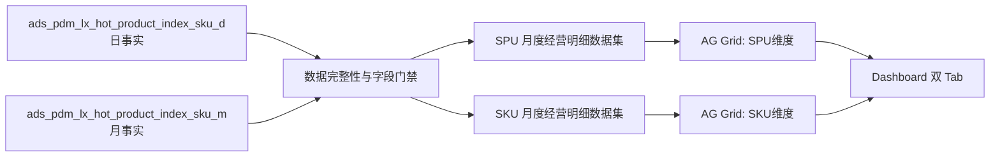

# 爆品指数 SPU/SKU 经营明细表设计

## 1. 目标与范围

本阶段在现有“拉杆箱在售产品爆品指数看板”中增加“爆品指数&经营指标报表”，优先完成 `SPU维度` 与 `SKU维度` 两张经营明细表。

最终看板仍需覆盖 FineBI 中的全部有效内容，但按以下顺序拆分为独立规格、计划和交付：

1. SPU/SKU 经营明细表。
2. 指标整体趋势与 SPU 销量排行榜。
3. SPU、SKU、颜色销售分布图。
4. 国家、SPU 开发经理、型号明细表。

本规格只负责第 1 项。`渠道（未启用）`、FineBI 空白文本占位和新增 Tab 的“+”入口不迁移。

FineBI 是布局、字段顺序、分组层级、填色和交互的视觉基线，不是指标口径的权威来源。指标口径继续服从已批准的爆品指数数据契约。

## 2. 已批准决策

- 两张表按月展示，不做筛选区间单行汇总。
- 同一区域使用双 Tab，默认打开 `SPU维度`，另一个 Tab 为 `SKU维度`。
- 完整保留 FineBI 可见字段，不交付精简版。
- 所有物理字段必须提供中文展示名，界面不得直接暴露英文列名。
- 全局小数最多保留 1 位；整数可不显示小数。
- 优先保持 FineBI 的层级、列顺序、表头、条纹、合计行和爆品指数填色效果。
- 数据缺失时不猜测、不填伪零、不从其他字段回退。

## 3. 实施方案选择

### 3.1 采用：ADS 契约补齐后由 Superset 聚合

继续以 `ads.ads_pdm_lx_hot_product_index_sku_d` 和 `ads.ads_pdm_lx_hot_product_index_sku_m` 为唯一业务服务源。数据表补齐明细表必需字段后，Superset 创建两个独立虚拟数据集和两个 AG Grid Table Scheme 图表。

优点：

- 指标口径集中在 ADS 与语义数据集，不把业务加工散落到图表 SQL。
- SPU、SKU、后续趋势、排行和分布图可复用同一契约。
- 可以对源表、数据集、图表和页面分别验收。

### 3.2 不采用：Superset 直接跨源关联

不允许 Superset 直接关联 FineBI 数据集、原始领星事实、库存或订单明细来补字段。该方式会绕开 Airflow 质量门禁，并产生与 ADS 不一致的第二套口径。

### 3.3 不采用：缺失字段占位发布

不以固定 `0`、空字符串或自造公式交付评分、订单量、实际库存数。缺失字段未通过数据前置门禁时，明细表不得标记为生产完成。

## 4. 架构与数据流

### 4.1 数据集边界

创建两个独立虚拟数据集：

- `爆品指数-SPU月度经营明细`
- `爆品指数-SKU月度经营明细`

两个数据集都使用左闭右开的月份过滤范围，返回筛选范围中的每个自然月，而不是只返回结束月份。当前月按全局数据水位截断；目标月份覆盖不完整时沿用现有 fail-closed 状态契约，不返回不完整业务结果。

页面筛选器只缩小展示事实。按 `ym + spu` 固定加工的 `spu_previous_month_sales_level` 不得因渠道、国家、SKU 等页面筛选重新评级。

### 4.2 表格组件

采用现有 `plugin-chart-ag-grid-table-scheme`，不新增爆品指数专用表格组件。配置应支持：

- 分组层级与展开/折叠。
- 固定左侧标识列。
- 横向滚动。
- 服务端分页。
- 列排序。
- 正确的合计行语义。
- 数值条件填色。
- 继承看板筛选器。

## 5. 行粒度与字段

### 5.1 SPU 维度

FineBI 的展示层级固定为：

`SPU -> 年月 -> SPU评级 -> 最终评级`

字段映射：

| 中文列名 | 语义字段 | 说明 |
|---|---|---|
| SPU | `spu` | 产品 SPU |
| 年月 | `ym` | 字符串 `YYYY-MM` |
| SPU评级 | `spu_previous_month_sales_level` | 目标月前一完整自然月的 SPU 人民币销售等级 |
| 最终评级 | `sku_level` | SKU 行级等级分组；同一 SPU 可出现多个值 |
| 爆品指数 | 派生指标 | 销量除以有效在售 SKU 日数 |
| 评分 | `score` | ADS 前置字段；不得从销售指标猜测 |
| 销售额 | `sales_amount_usd` | 美元金额 |
| 销量 | `sales_qty` | 销量合计 |
| 日均销量 | 派生指标 | 按明细口径的有效在售日重算 |
| 毛利润 | `gross_profit_usd` | 美元金额 |
| 毛利率 | 派生指标 | 毛利润除以销售额 |
| 退货量 | `return_goods_qty` | 退货商品数量 |
| 退货率 | 派生指标 | 退货量除以销量 |
| 订单量 | `order_qty` | ADS 前置字段 |
| 近7天日均销量 | 派生指标 | 以筛选有效结束日为锚点 |
| 近30天日均销量 | 派生指标 | 以筛选有效结束日为锚点 |
| 近90天日均销量 | 派生指标 | 以筛选有效结束日为锚点 |

`sku_level` 保持 SKU 行级真实多值。禁止用 `MAX`、`MIN`、优先级或任取一行生成唯一 SPU 最终评级。每个叶子行的业务粒度为 `ym + spu + spu_previous_month_sales_level + sku_level`；AG Grid 通过合并/分组视觉呈现 SPU 月层级。

### 5.2 SKU 维度

每个叶子行按 `ym + company_sku + sku + product_level + size + color` 聚合。公司 SKU 或维度值为空时保留空值语义，不从名称或 MSKU 推断。

字段顺序固定为：

1. 公司SKU
2. SKU
3. 年月
4. 产品等级
5. 尺寸
6. 颜色
7. 爆品指数
8. 评分
9. 销售额
10. 销量
11. 日均销量
12. 毛利润
13. 毛利率
14. 退货量
15. 退货率
16. 订单量
17. 近7天日均销量
18. 近30天日均销量
19. 近90天日均销量
20. 理论库存数
21. 实际库存数

`产品等级` 只能来自 `dim.dim_product.product_level` 已下发到 ADS 的 `product_level`；空值按既有契约显示“未评级”。理论库存使用 `theoretical_stock_qty`，不得跨 SID/MSKU 重复求和。实际库存使用 ADS 前置字段 `actual_stock_qty`。

## 6. 指标与合计语义

### 6.1 明细指标

- 爆品指数：`SUM(sales_qty) / 有效在售SKU日数`。
- 日均销量：按当前行实际参与计算的有效在售日重算，不平均可见子行。
- 近 7/30/90 天日均销量：分别读取筛选有效结束日向前 7、30、90 个自然日；时间窗跨出页面月份起点时仍需读取日表 lookback，页面过滤不得截断窗口事实。
- 毛利率：`SUM(gross_profit_usd) / NULLIF(SUM(sales_amount_usd), 0)`。
- 退货率：`SUM(return_goods_qty) / NULLIF(SUM(sales_qty), 0)`。

### 6.2 合计行

- 销售额、销量、毛利润、退货量、订单量：求和。
- 毛利率、退货率、日均销量、近 7/30/90 天日均销量：从底层分子和分母重新计算。
- 爆品指数、评分：保持 FineBI 的叶子行平均展示规则，不把可见值求和。
- 理论库存、实际库存：先在 SKU 粒度去重，再求和；不得累计同一 SKU 下发到多个身份行的重复库存。
- 分母为零或输入缺失时显示 `-`，不得显示 `Infinity`、`NaN` 或伪零。

## 7. 填色与表格样式

### 7.1 爆品指数填色

FineBI 现场读取确认其当前页面使用固定离散区间，而不是随筛选结果变化的动态分位数：

| 取值范围 | 背景色 |
|---|---|
| `value <= 0` | 红色 `#DF7461` |
| `0 < value < 5` | 黄色 `#FFC947` |
| `5 <= value < 10` | 浅绿色 `#B7D2B6` |
| `value >= 10` | 蓝色 `#2978B5` |
| `NULL` | 不填色，显示 `-` |

规则同时应用于 SPU 和 SKU 表的“爆品指数”数据单元格。排序、筛选、分页后仍按单元格业务值匹配固定区间。其他指标不套用该色阶，也不因爆品指数给整行着色。

### 7.2 表格主题

- 表头：绿色 `#8AA964`，白色文字。
- 明细条纹：同一绿色按约 5%/10% 透明度交替。
- 合计行：绿色实底、加粗。
- 当前 Tab 使用蓝色下划线，与 FineBI 交互一致。
- 标识列左对齐；金额、数量、比例和指数右对齐。
- 固定列宽和最小宽度，长 SKU 可截断并通过 Tooltip 查看完整值。
- 页面及表格不得因展开、加载、空状态或最长字段值产生错位或覆盖。

## 8. 数字格式

- 所有小数最多保留 1 位，末尾无意义的 `.0` 可省略。
- 销售额、毛利润使用千分位和美元语义，不混入人民币符号。
- 销量、退货量、订单量和库存使用千分位。
- 毛利率、退货率使用百分比，最多 1 位小数。
- 爆品指数、评分和日均销量最多 1 位小数。
- 数据层保持原精度；显示格式不得反向改变计算结果。

## 9. 筛选、排序与分页

现有筛选器全部作用于两张明细表：渠道、品线、SPU、国家、公司 SKU、SKU、尺寸、颜色、年月、开发经理、型号、SKU 等级、产品等级。

默认排序：

1. `ym` 倒序。
2. 同月按 `sales_qty` 倒序。
3. 再按 SPU 或 SKU 标识稳定升序，保证分页结果稳定。

分页采用服务端分页。切换 Tab 时保留全局筛选条件，但两个 Tab 各自维护页码、展开和列排序状态；筛选条件变化后重置为第一页。

## 10. 数据前置门禁

现有 ADS DDL 已提供销售、利润、退货、月销量、理论库存、资格和产品维度，但未提供以下三个完整迁移字段：

| 必需字段 | 类型要求 | 门禁 |
|---|---|---|
| `score` | `DECIMAL`，可空 | 必须有批准的权威来源、粒度和聚合规则 |
| `order_qty` | `BIGINT`，不可负 | 必须在日事实可加总，并与月表对账 |
| `actual_stock_qty` | `DECIMAL`，可空 | 必须定义库存时点，且在 SKU 粒度去重后汇总 |

数据表负责 Agent 必须先提交独立的数据契约增量和生产验收证据。Superset 不直接读取 FineBI 内部加工表，也不以 FineBI 结果倒推填充。三个字段中任一未通过门禁时，可开发和验证已有字段，但不得宣布两张经营明细表完整生产交付。

滚动 7/30/90 天指标不要求新增持久化列，但日表必须覆盖有效结束日前完整 90 天 lookback；缺口时整组滚动指标显示不可用状态，不用短窗口冒充完整窗口。

## 11. 错误与空状态

- 月份覆盖不完整：沿用现有数据状态组件提示，明细表不返回部分业务数据。
- 评级源不完整：SPU评级显示缺失状态，不把 `NULL` 合并为业务等级 `-`。
- 维度未维护：显示“未评级”或 `-`，遵循字段原契约。
- 指标分母为零：显示 `-`。
- API 或查询失败：显示 Superset 标准错误状态，不回退到缓存样例或静态占位数据。
- 数据量超过限制：服务端分页和明确行数上限生效，不切换到客户端全量加载。

## 12. 验收与测试

### 12.1 生成器和数据集测试

- 两个数据集、两个图表、双 Tab 位置和固定 UUID 可重复生成。
- 所有数据列具有中文 `verbose_name`。
- SQL 使用完整月份范围、90 天 lookback 和 fail-closed 覆盖门禁。
- 比率使用分子/分母重算；库存先去重再汇总。
- 缺失的 ADS 前置字段会快速失败，不静默删除列。

### 12.2 AG Grid 测试

- SPU 层级展开、SKU 表分页、排序和筛选正确。
- 爆品指数边界样例 `0`、`0.1`、`4.9`、`5`、`9.9`、`10`、`NULL` 分别取得批准颜色。
- 合计行不会求和比率，不会重复累计库存。
- 数字格式最多 1 位小数，中文表头不截断成物理字段名。

### 12.3 生产浏览器验收

- 与 FineBI 对照 SPU/SKU 列顺序、分组层级、表头、条纹、合计行和填色。
- 在相同月份和筛选条件下抽查至少 5 个 SPU 组、10 个 SKU 行。
- 对照底层 SQL 验证销售额、销量、利润、退货、比率、爆品指数、滚动指标和库存。
- 检查桌面常用宽度下无重叠、空白表格或横向滚动失效。
- 检查浏览器控制台、图表数据请求和 Superset 服务日志无新增错误。

## 13. 发布边界

本阶段完成必须同时满足：

1. 数据前置门禁通过。
2. 生成器和聚焦测试通过。
3. 前端生产构建通过。
4. `pre-commit run --all-files` 在干净发布基线通过。
5. 生产导入、浏览器对照和底层 SQL 抽查通过。
6. 发布前完成元数据备份并保留可执行回滚路径。

现有工作树中的无关改动不得被暂存、提交、覆盖或回滚。生产发布只允许使用经过验证的提交基线。
