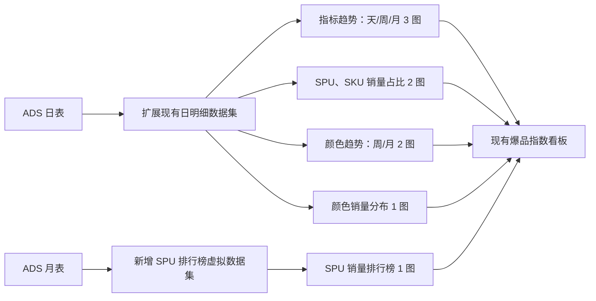

# 爆品指数剩余六个图表设计

## 1. 目标与范围

本阶段在生产看板“拉杆箱在售产品爆品指数看板”中补齐 FineBI 主画布剩余的六个可见组件：

1. 指标整体趋势。
2. SPU 销量排行榜。
3. SPU 销售比例。
4. SKU 销售比例。
5. 颜色销售比例。
6. 颜色销量分布。

本阶段不新增国家、SPU 开发经理、型号或渠道明细 Tab，不迁移 FineBI 中未启用、隐藏、重复、备用或空白组件。

FineBI 是布局、交互、字段绑定和可见结果的基线，但不是权威数据源。可以从 FineBI 编辑器确认的逻辑严格复刻；FineBI 未暴露的内部公式，以可见结果为验收基线，并使用已批准的 ADS 数据契约复算。禁止直接依赖 FineBI 内部加工表、从可见结果反推伪公式或绕过 ADS 质量门禁。

## 2. 已确认的 FineBI 基线

FineBI 页面：

`https://bi.wbkjgr.com/webroot/decision/v5/conf/subject/page/edit/32438f1801904a4e83f833ddd5e53adc/report/b4d575c74907450fa4d1f8ea7177d394`

现场读取确认：

- 指标整体趋势使用日期横轴，配置 11 个指标，并提供天、周、月切换。
- SPU 排行榜来自独立数据资源 `LX_产品表现_spu销量排行榜`，按本月销售额降序，展示 SPU、SPU 评级、最终评级、上月销售额、本月销售额、评级达标进度和时间达标进度。
- 排行榜评级达标进度的固定色阶为 `[0,20%)` 红、`[20%,40%)` 橙、`[40%,60%)` 黄、`[60%,80%)` 绿、`[80%,+∞)` 蓝。
- SPU、SKU 环图展示销量及销量占比，中心显示总销量。
- 颜色周图使用 `年周数-w + 颜色代码 + 销量求和`；月图使用 `年月 + 颜色代码 + 销量求和`。
- 颜色销量分布使用 `颜色代码 + 销量求和占比`。

FineBI 未暴露的内部实现按本规格固定，不再作为实现期开放问题：排行榜使用统一美元口径和数据水位月；趋势轴按金额类与非金额类划分；环图按筛选后销量计算全量分类占比；周采用 ISO 周。

## 3. 方案选择

### 3.1 采用：现有 ADS、标准 Superset 图表和一个排行榜数据集

- 复用 `ads.ads_pdm_lx_hot_product_index_sku_d` 和 `ads.ads_pdm_lx_hot_product_index_sku_m`。
- 扩展现有“爆品指数-日明细”数据集的计算列和指标。
- 新增一个 SPU 排行榜虚拟数据集，负责数据水位月和上一完整月的同币种比较。
- 使用 Superset 标准 `mixed_timeseries`、`pie`、`timeseries` 和现有 `ag-grid-table-scheme`。
- 用 Dashboard Tabs 组合三个趋势图和两个颜色趋势图，使页面仍呈现六个可见组件。
- 不新增 ADS 表，不开发新图表插件。现有 Pie 插件把查询行数硬限制为 100，无法覆盖当前可能超过 100 个 SKU 的真实场景；本阶段只对该通用上限做最小扩展，允许生成资产请求最多 1,000 个类别，并为中心总计增加可选纯文本标签，使目标环图显示“总销量”。默认值和其他 Pie 图表行为不变。
- Mixed Timeseries 已支持安全自定义 ECharts 选项，但当前安全 schema 未放行静态 `legend.selected`。为复刻 FineBI 的初始图例状态，本阶段只在现有 schema 中增加 `Record<string, boolean>` 形式的静态 `legend.selected`，继续禁止函数、表达式和其他未授权属性，并增加解析回归测试。

该方案新增 1 个数据集和 9 个底层图表资产。交付后固定资产总量为 6 个数据集、24 个图表和 2 个看板；主看板关联 23 个底层图表，说明看板关联 1 个图表。

### 3.2 不采用：通用 UNION 分析数据集

不把不同时间粒度、维度类型和指标类型编码到一个通用 UNION 数据集中。该方案资产数量较少，但会使筛选、格式、聚合和错误处理高度耦合，降低可读性和可测试性。

### 3.3 不采用：新增趋势、排行和分布 ADS 汇总表

现有 ADS 字段足以支撑六个组件。新增汇总表会扩大 Airflow、DDL、回填和生产发布范围，当前没有数据量或查询性能证据证明其必要性。

## 4. 架构与数据流

Superset 不直接连接领星原始表、FineBI 数据资源、汇率表或商品关系表。身份解析、在售资格和月份覆盖继续由现有 ADS 发布流程负责。

生产发布前必须重新验证日表和月表包含已批准字段，尤其是趋势使用的 `order_qty`。字段缺失时快速失败，不删除指标、不返回静态样例，也不从其他字段回退。

## 5. 筛选与时间规则

### 5.1 全局筛选

指标趋势、SPU 销量占比、SKU 销量占比、颜色销售比例和颜色销量分布响应全部 13 个全局筛选器：渠道、品线、SPU、国家、公司 SKU、SKU、尺寸、颜色、年月、开发经理、型号、SKU 等级、产品等级。

SPU 排行榜不响应年月筛选，响应其余 12 个筛选器。其他筛选条件同时作用于排行榜本月和上月销售额；按 `ym + spu` 固定发布的 SPU 评级不因页面筛选重新评级。

### 5.2 时间规则

- 日粒度使用 `sales_date`。
- 周粒度使用 ISO 周，周一开始，展示键为 `YYYYWww`。
- 月粒度使用字符串 `ym = YYYY-MM`。
- 趋势和颜色图只聚合年月筛选的左闭右开范围。筛选边界落在周中时裁剪该周，不读取范围外日期。
- 当前月按 `data_through_date` 截断，不按系统日期补未来零值。
- 排行榜“本月”固定为全局数据水位所在自然月 MTD，“上月”为其上一完整自然月。

## 6. 指标整体趋势

### 6.1 页面行为

使用一个 Dashboard Tabs 容器展示“天 / 周 / 月”三个 `mixed_timeseries` 图表。默认打开“天”。三个图表共享字段、指标顺序、颜色、图例和格式，仅时间桶不同。

默认开启爆品指数、销售额和毛利润系列。其余系列保留在图例中，由用户按 FineBI 方式开启或关闭。初始图例选择通过 Mixed Timeseries 已支持的安全自定义 ECharts 选项设置；只扩展静态 `legend.selected` 的安全 schema，不新增专用渲染逻辑。

### 6.2 指标口径

| 指标        | 时间桶内计算                                               |
| ----------- | ---------------------------------------------------------- |
| 爆品指数    | `SUM(sales_qty) / COUNT(DISTINCT sales_date, sku)`         |
| 销量        | `SUM(sales_qty)`                                           |
| 日均销量    | `SUM(sales_qty) / 有效自然日数`                            |
| 销售额      | `SUM(sales_amount_usd)`                                    |
| 退货量      | `SUM(return_goods_qty)`                                    |
| 订单量      | `SUM(order_qty)`                                           |
| 在售 SKU 数 | `COUNT(DISTINCT sku)`                                      |
| 在售 SPU 数 | `COUNT(DISTINCT spu)`                                      |
| 毛利润      | `SUM(gross_profit_usd)`                                    |
| 退货率      | `SUM(return_goods_qty) / NULLIF(SUM(sales_qty), 0)`        |
| 毛利率      | `SUM(gross_profit_usd) / NULLIF(SUM(sales_amount_usd), 0)` |

有效自然日数取当前时间桶与有效筛选范围交集中的自然日数量。日表已经包含批准的补零事实，禁止改为仅统计有销量的日期。

### 6.3 图形与格式

- 销售额和毛利润使用右轴；其他指标使用左轴。
- 金额标签以“万”为单位，底层计算保持美元原精度。
- 比例使用百分比；数量、指数和金额的小数最多保留 1 位。
- 图例、轴标题和 tooltip 均使用中文业务名称，不暴露物理字段名。

## 7. SPU 销量排行榜

### 7.1 数据粒度与字段

每个叶子行为 `数据水位月 + spu + sku_level`。同一 SPU 下存在多个最终评级时允许拆成多行，禁止使用 `MAX`、`MIN`、优先级或任取一行生成唯一评级。

列顺序固定为：

1. SPU。
2. SPU 评级。
3. 最终评级。
4. 上月销售额。
5. 本月销量额。
6. 本月评级达标进度。
7. 本月时间达标进度。

“本月销量额”保留 FineBI 可见标题，实际语义为本月销售额。

### 7.2 指标口径

- `SPU评级 = spu_previous_month_sales_level`。
- `最终评级 = sku_level`。
- 上月销售额和本月销售额均使用 `sales_amount_usd` 聚合。
- `本月评级达标进度 = 本月销售额 / 上月销售额`。
- `本月时间达标进度 = 本月评级达标进度 / (DAY(data_through_date) / 当月自然日数)`。

上月销售额为零、月份覆盖不完整或输入缺失时，两个进度均显示 `-`。禁止把 `spu_previous_month_sales_amount_cny` 与本月美元销售额相除。

### 7.3 表格行为与条件格式

- 使用 `ag-grid-table-scheme` 和服务端分页，每页 50 行。
- 默认按本月销售额降序，再按 SPU、最终评级稳定升序。
- 仅“本月评级达标进度”单元格填色，不做整行填色。区间和颜色严格使用 FineBI 编辑器实读值：
  - `[0%,20%)`：红色 `#FF0000`。
  - `[20%,40%)`：橙色 `#EB8A3A`。
  - `[40%,60%)`：黄色 `#FFC947`。
  - `[60%,80%)`：绿色 `#00FF00`。
  - `[80%,+∞)`：蓝色 `#0078FF`。
- 负值和 `NULL` 不套入上述区间；`NULL` 显示 `-`。

## 8. 销量占比与颜色图

### 8.1 SPU 和 SKU 销量占比

- 使用 `pie` 环图，指标统一为 `SUM(sales_qty)`。
- SPU 图按 `spu` 分组；SKU 图按 `sku` 分组。
- 中心显示“总销量”和筛选后销量总数。
- 外部标签显示分类名称和销量占比。
- 按销量降序，保留全部非空分类，不生成“其他”桶。
- SKU 使用滚动图例，避免大量 SKU 挤压图形。
- 三个环图的查询上限固定为 1,000。发布前必须在全部有效 ADS 历史范围内分别校验 SPU、SKU 和颜色代码的去重基数不超过 1,000；任一基数超限时阻断发布，禁止静默截断为前 1,000 类。

### 8.2 颜色销售比例

使用 Dashboard Tabs 展示“周 / 月”两个 `timeseries` 图表，不迁移 FineBI 编辑态的“+”入口。

- 周横轴为 ISO `YYYYWww`，月横轴为 `YYYY-MM`。
- Y 轴为 `SUM(sales_qty)`。
- 颜色代码作为系列，数据标签显示整数销量。
- `color` 包含 `-` 时取最后一个 `-` 后的非空文本作为颜色代码，例如 `枪黑-GBK -> GBK`；不含 `-` 时保留完整非空颜色值。
- `NULL` 或空颜色不生成伪颜色代码。

### 8.3 颜色销量分布

- 使用 `pie` 环图，按颜色代码汇总 `SUM(sales_qty)`。
- 标签显示颜色代码和销量占比，中心显示总销量。
- 按销量降序，不合并“其他”，不混入销售额或库存。

## 9. 页面布局与视觉规则

六个组件追加在现有 SPU/SKU 明细 Tab 下方，保持 FineBI 顺序：

- 第一行：指标整体趋势占 `8/12`，SPU 销量排行榜占 `4/12`。
- 第二行：SPU 销售比例、SKU 销售比例、颜色销售比例、颜色销量分布各占 `3/12`。

页面继续使用现有爆品指数看板的绿色主题、白色内容区、紧凑标题和间距。组件不得套用营销式卡片、渐变装饰或与现有看板无关的视觉体系。

所有标题、表头、轴、图例、tooltip 和空状态必须使用中文。全局小数最多保留 1 位；整数不强制显示 `.0`。布局必须在生产常用宽屏和 1440px 桌面宽度下无覆盖、截断或异常位移。

## 10. 数据门禁与错误处理

- 趋势、占比和颜色图要求所选月份的日表与月表覆盖门禁通过；任一月份不完整时 fail closed。
- 排行榜要求数据水位月 MTD 和上一完整月同时通过覆盖门禁；任一月份不完整时排行榜整体不可用。
- 比例分母为零时显示 `-`，不得显示 `Infinity`、`NaN` 或伪零。
- 维度空值保持源语义，不从 SKU、MSKU 或名称推断。
- API 或查询失败时显示 Superset 标准错误状态，不回退到缓存样例或静态占位数据。
- 实现前只读核验生产 ADS schema。若生产字段和已批准契约不一致，数据层修复由 ETL 所有者完成；Superset 不增加兼容 fallback。
- 发布前执行环图类别基数门禁。全量有效历史中的 SPU、SKU 或颜色代码任一去重数超过 1,000 时停止发布，重新评估可视化协议，不允许由查询上限静默丢失类别。

## 11. 测试与验收

### 11.1 生成器和 SQL 单测

- 固定生成 6 个数据集、24 个图表和 2 个看板。
- 主看板关联 23 个底层图表，说明看板关联 1 个图表。
- 所有新增数据集、图表、Tabs 和布局节点使用固定 UUID 或组件 ID，可重复生成。
- 所有可见字段具有中文名称。
- 校验 ISO 周跨年边界、筛选范围内周裁剪和月粒度聚合。
- 校验 11 个趋势指标的聚合、加权比率和零分母行为。
- 校验排行榜数据水位月、上一月、美元口径、多最终评级拆行和稳定排序。
- 校验排行榜不受年月筛选影响，但受其余 12 个筛选器影响。
- 校验占比分母、全量分类、无“其他”桶和颜色代码规则。
- 校验排行榜条件色边界 `0%`、`20%`、`40%`、`60%`、`80%`。
- 校验 Pie 默认查询行为不变、目标图的 `row_limit=1000` 不会被重新压缩为 100、可选中心标签显示“总销量”，并为生产类别基数门禁提供只读验收 SQL。

### 11.2 生产数据和 API 验收

- 发布前抽样对账 ADS 日表、月表、虚拟数据集和图表结果。
- 对 9 个新增底层图表逐一执行 Chart Data API；要求 HTTP 200、结果成功、无 error/warning，并符合空结果合同。
- 使用相同年月和其余筛选条件，与 FineBI 对账趋势、排行榜、占比和颜色结果。
- 排行榜必须单独验证年月筛选变化不会改变数据水位月锚点。

### 11.3 浏览器和发布验收

- Chrome 验收趋势天/周/月、颜色周/月、图例开关、环图中心总销量、排行榜排序、分页和五档填色。
- 验收 13 个全局筛选器、排行榜 12 个筛选器作用域及现有总览、漏斗和明细表无回归。
- 验收桌面常用宽屏和 1440px 视口，无组件重叠或文本溢出。
- 发布前备份现有看板、数据集和图表 metadata，并生成可执行回滚包。
- 本阶段不新增插件，但包含 Pie 查询上限/可选中心标签和 Mixed Timeseries 静态 `legend.selected` 安全 schema 的两个小范围前端修改。生产发布必须从精确提交构建前端资产、重建镜像并重建 Superset 服务，不能只导入 metadata。
- 独立生产终审必须得到 `FINAL_COMPLETION_ALLOWED=YES` 后才可声明完整交付。

## 12. 明确排除

- 国家、SPU 开发经理、型号和渠道明细 Tab。
- FineBI 隐藏、重复、备用、空白组件及编辑态“+”入口。
- 新 ADS 汇总表、直接跨源查询和 FineBI 内部数据资源依赖。
- 为本阶段开发新的通用图表插件。
- 与六个目标组件无关的 Superset 前端重构或视觉改版。
